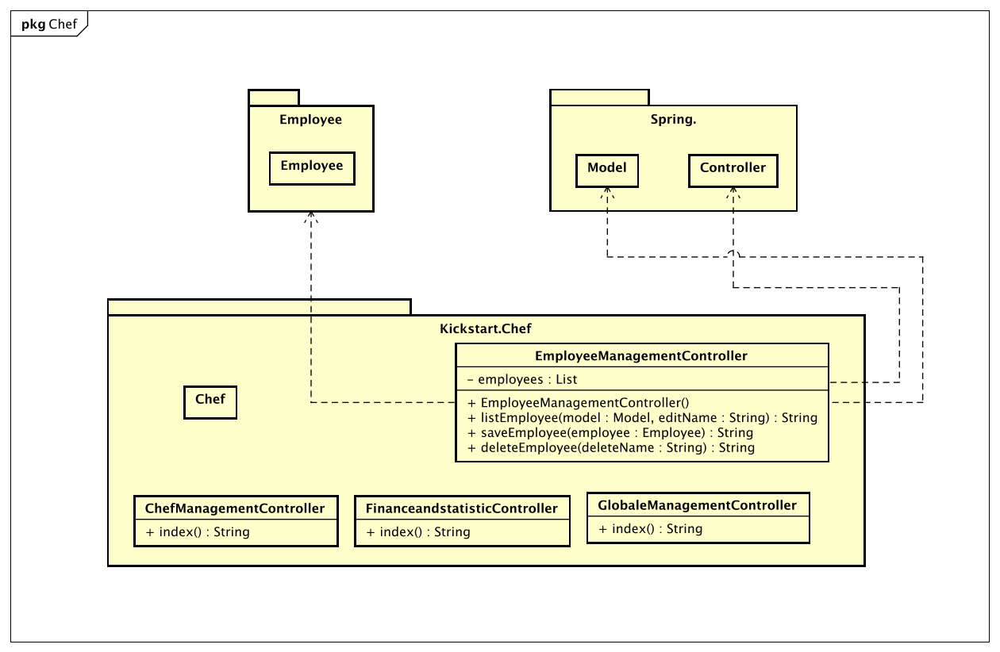

= Entwicklerdokumentation
:project_name: ProFit Webseite
:imagesdir: images
:toc: left
:numbered:

[options="header"]
[cols="1, 3, 3"]
|===
|Version | Bearbeitungsdatum   | Autor 
|...	| ... | ...
|===

== Einführung
Das Fitnessstudio ProFit ist ein mittelgroßes Fitnessstudio in dem Herzen von Dresden. Es erfreut sich großer Beliebtheit und hat eine große Anzahl an Mitgliedern. Nun soll die Verwaltung des Studios digitalisiert werden, damit die Mitarbeiter und Mitglieder sich auf das Wesentliche konzentrieren können. Dabei sollen verschiedene Geschäftsfelder berücksichtigt werden.

Der Inhaber des Fitnessstudios (Chef) besitzt einen speziellen Login und ist für die Verwaltung des Equipments, wie auch der Mitarbeiter Zuständig. Er erstellt die zugehörigen Accounts der Mitarbeiter (hireEmployee), teilt ihnen ihre Rechte zu und vergibt ein Einmal-Passwort (EntryPasswort).

In der Mitarbeiterverwaltung können die Mitarbeiter (Employee) des Fitnessstudios (ProFit) eingestellt (hireEmployee), bearbeitet (editEmployee)und entlassen (fireEmployee) werden. Die Mitarbeiter haben verschiedene Eigenschaften: Name (Name), Alter (Age), Gehalt (Salary), Überstunden (OverTime). Ein Dienstplan (WorkSchedule) muss ebenfalls erstellt werden, es muss zu jeder Zeit mind. eine Thekenkraft (CounterStaff) und ein Trainer (Trainer) anwesend sein. Am Abend muss eine Reinigungskraft (Cleaner) für 1h eingetragen sein. Die Mitarbeiter sollen einen eigenen Login (Login) bekommen, um den Dienstplan zu betrachten und Urlaubsanträge (VacationRequest)zu stellen. Es sollen ebenfalls alle Mitglieder (Member) verwaltet werden können. Eigenschaften: Name (Name), Geburtstag (Birthday), E-mail (EMail), Adresse (Adress), Einstieg (SignUp), Passwort (Password), PayPalKonto (PayPal). Diese können in dem Studio aufgenommen (admitMember), bearbeitet (editMember) und gekündigt (quitMember) werden. Bei der Aufnahme soll ein Login (Login) erstellt werden, damit der Kunde von zu Hause aus seinen nächsten Trainingstermin (TrainingDate) samt Trainingsplan (TrainingSchedule) nachschlagen kann, Rechnungen (Invoice) betrachten kann und um persönliche Daten (editData) zu ändern . Für jedes Mitglied kann ein individueller Trainingsplan durch den Trainer erstellt werden.

Wirbt ein Mitglied ein neues Mitglied an, wird ihm ein bestimmter Betrag (ReruitmentBonus) auf sein Kundenkonto (Account) gutgeschrieben, welches er nur an der Theke (Counter) verbrauchen kann und nicht ausgezahlt wird. Kunden (Guest), die zum ersten Mal das Studio besuchen, können mit einem Trainer ein Probetraining (TrialTraining) vereinbaren, entweder direkt im Studio oder über das Internetportal des Studios. Eine Mitgliedschaft kostet eine monatliche Gebühr (Fee) und kann pro Jahr für einen Monat ohne Gründe ausgesetzt werden. Am Ende des Monats wird für jeden Kunden eine Rechnung über sein Kundenkonto erstellt.

Des Weiteren gibt es einen Eingangs- und Verkaufsbereich (Counter). An der Theke können auch Getränke (Drinks), Nahrungsergänzungsmittel (Supplements) oder Zubehör (Equipment) erworben (buy) werden, diese werden bar bezahlt oder direkt vom Kundenkonto abgebucht. Die Artikel des Verkaufsbereiches müssen sich ebenfalls verwalten lassen. Es müssen Artikel (Item) hinzugefügt (addItem), bearbeitet (editItem) und gelöscht (deleteItem) werden können. Beim Unterschreiten der Mindestmenge (MinimumQuantity) müssen die Artikel für den Angestellten markiert (flagItem) werden, um nachbestellt (reorderItem) werden zu können. Artikel die für den Verzehr gedacht sind, haben ein Verfallsdatum (ExpiryDate), welches regelmäßig überprüft werden soll. Für verschiedene Artikel soll man feinen Rabatt (Discount) angeben können. Ebenfalls sollen Statistiken (Statistics) über laufende Kosten (Costs), Einnahmen (Profit), Kundenverhalten (MemberBehaviour) und Verkaufsartikel (SoldItems) dargestellt werden. Verschiedene Einstellungen wie Vertragslaufzeit (ContractRuntime), monatliche Gebühren (Fee), Neuwerbungsprämie (RecruitmentBonus), Öffnungszeiten (OpeningHours), Rabatt usw. sollen sich einfach global, vom Chef, verändern lassen.

== Randbedingungen
=== Hardware-Vorgaben
 - Server (Unternehmen)
 - Computer mit Internetverbindung (End-Nutzer)
 - Tastatur (End-Nutzer)
 - Maus (End-Nutzer)

=== Software-Vorgaben
Die folgende (oder neuere) Java Version ist erforderlich für die Ausführung der Webseite:
 - Java 21
Die folgenden (oder neueren) Browser Versionen sind erforderlich für die Nutzung der Webseite:
 - Firefox 130.0.0
 - Google Chrome 131.0.0
 - Chromium based browsers 130.0.0
 - Opera 114.0.0
 - Safari 18.0

=== Vorgaben zum Betrieb der Software
Das System soll zur digitalen Organisation des Fitnessstudios ProFit verwendet werden. Die Software soll von einem Server Ausgeführt und über das Internet, mit hilfe eines Browsers, 24/7 erreichbar sein.

Die Primären Nutzer dieser Software sind die Mitarbeiter und die Mitglieder des Fitnessstudios und es ist angenommen das sie sich mit der typischen Navigation von Webseiten auskennen, sowie der Chef, welcher nicht unbedingt technische Erfahrung besitzt. 

Alle Daten sollen langwierig auf einer Datenbank gespeichert werden und sollen über die Webseite erreichbar sein.

== Kontextabgrenzung

image::Kontext C4 Profit.png[]
Kontextdiagramm in C4 Notation

== Lösungsstrategie
=== Erfüllung der Qualitätsziele
[options="header"]
|=== 
|Qualitätsziel |Lösungsansatz
|Instandhaltung |
 - *Modularität*: Die Anwendung besteht aus einzelnen Komponenten, sodass     Änderungen an einer Komponente geringere Auswirkungen auf andere           Komponenten haben.

 - *Wiederverwendbarkeit*: Sicherstellen, dass die Komponenten des Systems    von anderen Komponenten oder Systemen wiederverwendet werden können.

 - *Aktualisierbar*: Sicherstellen, dass die Anwendung modifiziert oder       erweitert werden kann, ohne Fehler zu verursachen oder die                 Produktqualität zu beeinträchigen.
|Benutzbarkeit |
 - *Verständlichkeit*: Sicherstellen, dass die Nutzer das System leicht verstehen und bedienen können. Um dies zu gewährleisten sollte auf eindeutige Beschreibung der Eingabefelder geachtet werden.

 - *Umgang mit Fehlern/ Fehlervermeidung*: Um Nutzer daran zu hindern Fehler auszulösen, sollten ungültige Eingaben nicht zu ungültigen Systemzustäden führen.

- *Ästhetik der Benutzeroberfläche*: Den Nutzern soll eine ansprechende und zufriedenstellende Interaktion geboten werden.

- *Barrierefreiheit*: Sicherstellen, dass Menschen mit unterschiedlichen Bedürfnissen das System uneingeschränkt nutzen können. Dies sollte durch die Verwendung geeigneter Schriftgrößen und Farbkontraste erreicht werden.
|Sicherheit |
 - *Vertraulichkeit*: Sicherstellen, dass nur autorisierte Personen auf die Daten zugreifen können. 

 - *Integrität*: Verhinderung von unbefugten Datenänderungen. 

 - *Verantwortlichkeit*: Gewährleistung der Nachvollziehbarkeit von Aktionen oder Ereignissen und deren eindeutige Zuordnung zu einer Entität oder Person. 
|===

=== Softwarearchitektur

image::C4-Modell (Ebene 2_ Container).svg[]
Containerdiagramm in C4 Notation

image::Client-Server-Modell.png[]
Client-Server-Modell

*Funktionsweise*: HTML-Templates werden serverseitig gerendert und durch den Client mit den zugehörigen CSS-Stylesheets dargestellt. Die in den Templates angezeigten Daten werden von Thymeleaf bereitgestellt. Thymeleaf erhält die angeforderten Daten von den Controller-Klassen, die im Backend realisiert sind. Diese Controller-Klassen greifen wiederum auf Instanzen und Methoden der Model-Klassen zurück. Eine integrierte H2-Datenbank sichert die Daten standardmäßig persistent.

=== Entwurfsentscheidungen
==== Verwendete Muster
* Spring MVC
* Strategy Pattern
* Factory Method Pattern

==== Persistenz

Die Anwendung verwendet Hibernate Annotation-basiertes Mapping, um Java-Klassen auf Datenbanktabellen abzubilden. Als Datenbank wird H2 verwendet.
Die Persistenz ist standardmäßig deaktiviert. Um die Persistenzspeicherung zu aktivieren, müssen die folgenden zwei Zeilen in der Datei application.properties auskommentiert werden:
....
# spring.datasource.url=jdbc:h2:./db/kickstart
# spring.jpa.hibernate.ddl-auto=update
....
==== Benutzeroberfläche

image::Dialog Map.svg[]
Dialog Map

==== Verwendung externer Frameworks

[options="header", cols="1,2,3"]
|===
| External Library    | Category          | Beschreibung                                                                 

| Spring Boot         | General Purpose   | Framework für die Entwicklung von Java-Anwendungen, vereinfacht die Konfiguration und beschleunigt die Entwicklung 
| Spring Data JPA     | Persistence       | Bietet eine vereinfachte Datenzugriffsschicht für JPA-basierte Repository-Implementierungen 
| Spring Security     | Security          | Umfassendes Sicherheits-Framework für Authentifizierung und Autorisierung in Spring-Anwendungen 
| Spring Mail         | Integration       | Bibliothek für den Versand von E-Mails innerhalb von Spring-Anwendungen 
| Thymeleaf           | UI                | Moderner Server-seitiger Java-Template-Engine für Web-Anwendungen 
| Semantic UI         | UI                | Mit Semantic UI lässt sich das UI leicht gestalten und eine einheitliche Struktur sicherstellen. 
| Salespoint Framework| Business Logic    | Spezialisiertes Framework für E-Commerce und Geschäftsanwendungen 
|===

== Bausteinsicht

image::package diagram.svg[]
Package Diagramm

=== Entwurfsklassendiagramme der einzelnen Packages

Package Chef

image::Employee diagram.svg[]
Package Employee

image::package member.svg[]
Package Member

image::PackageInventory.svg[]
Package Inventory

image::PackageCatalog.svg[]
Package Catalog

[options="header"]
|=== 
|Klasse/Enumeration |Description
|User                  |Ist die Darstellung einer realen Person            
|Registered User       |Ist eine repräsentation einer realen Person welche im System gespeichert ist 
|Member                |Ist ein als Mitglied registrierter User   
|Chef                  |Ist ein als Chef registrierter User 
|Employee              |Ist ein als Mitarbeietr registrierter User 
|ItemCatalog           |Ist eine Gruppierung von verkäuflichen Items
|Item                  |Representiert einen Gegenstand im Online-Catalog 
|Food                  |Ist ein essbares Produkt im Online-Shop
|Others                |Sind Items im Online-Shop die kein essen sind
|Inventory             |Stellt den Bestand der Items im ItemCatalog dar
|Inventory-Item        |Stellt die anzahl der verfügbaren Items im inventory dar
|===

=== Rückverfolgbarkeit zwischen Analyse- und Entwurfsmodell
_Die folgende Tabelle zeigt die Rückverfolgbarkeit zwischen Entwurfs- und Analysemodell._

[options="header"]
|===
|Klasse/Enumeration (Analysemodell) |Klasse/Enumeration (Entwurfsmodell)
|Item |kickstart.catalog.Item
|FOOD |kickstart.catalog.ItemType
|OTHERS |kickstart.catalog.Itemtype
|Inventory |salespointframework.UniqueInventory
|InventoryItem |salespointframework.UniqueInventoryItem
|ItemCatalog |salespointframework.catalog 
|User/Registered User |salespointframework.UserAccount
|Chef |kickstart.chef.Chef
|Employee |kickstart.employee.Employee
|Member |kickstart.member.Member
|Mitarbeiterverwaltung |kickstart.chef.EmployeeManagementController
|Mitgliederverwaltung |kickstart.member.MemberManagement
|Mitarbeiterportal |kickstart.employee.EmployeeController
|Mitgliederportal |kickstart.member.MemberPortalController
|ProFit |kicksart.Application

|===

== Laufzeitsicht
* Darstellung der Komponenteninteraktion anhand eines Sequenzdiagramms, welches die relevantesten Interaktionen darstellt.

