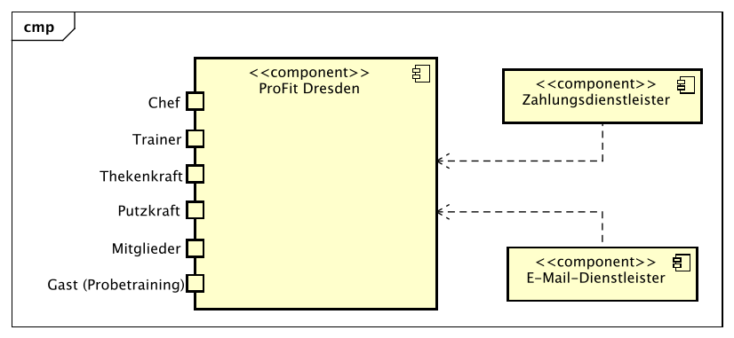
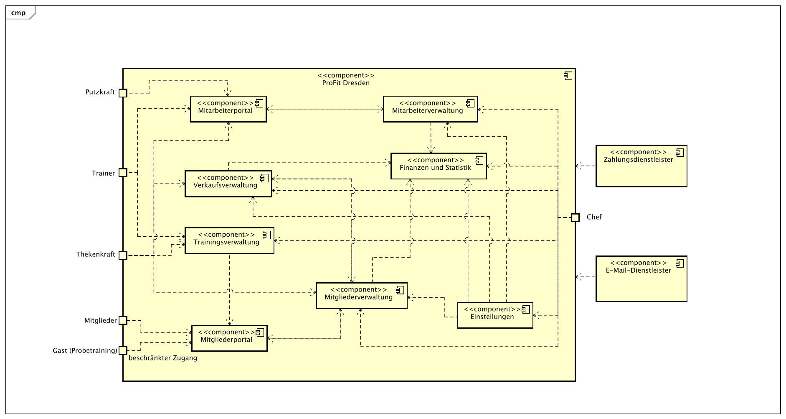
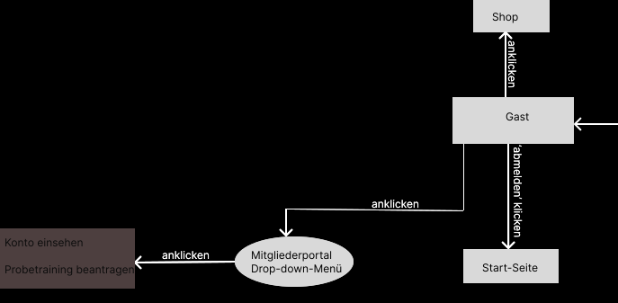
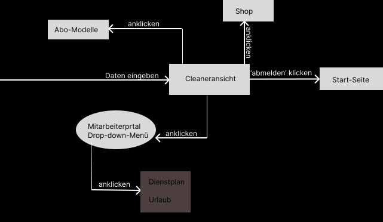
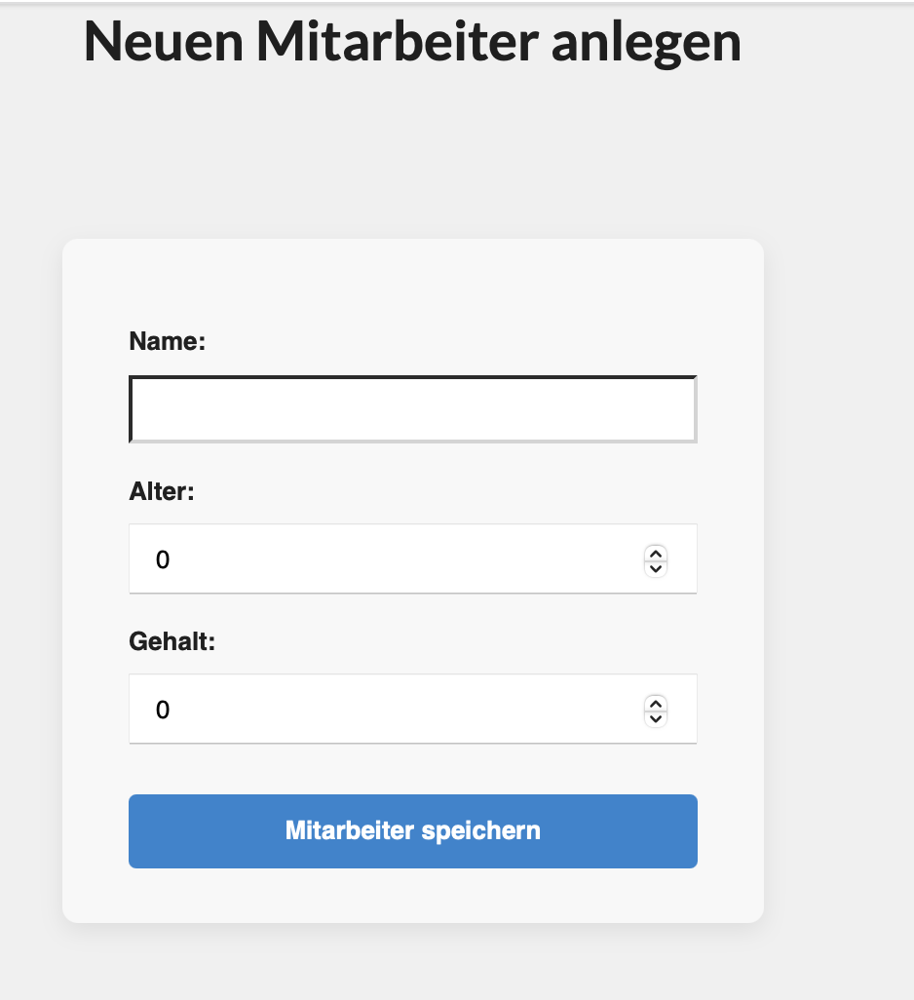
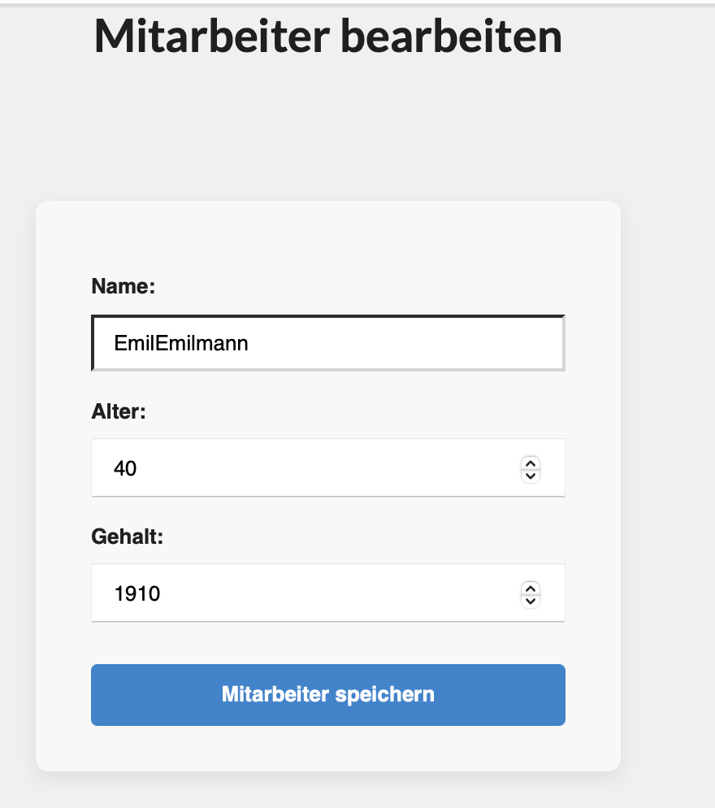
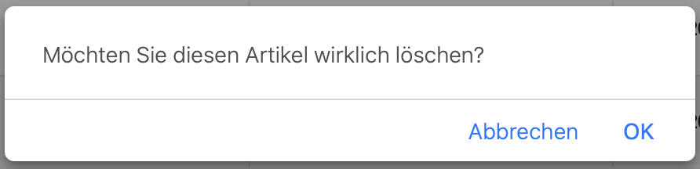
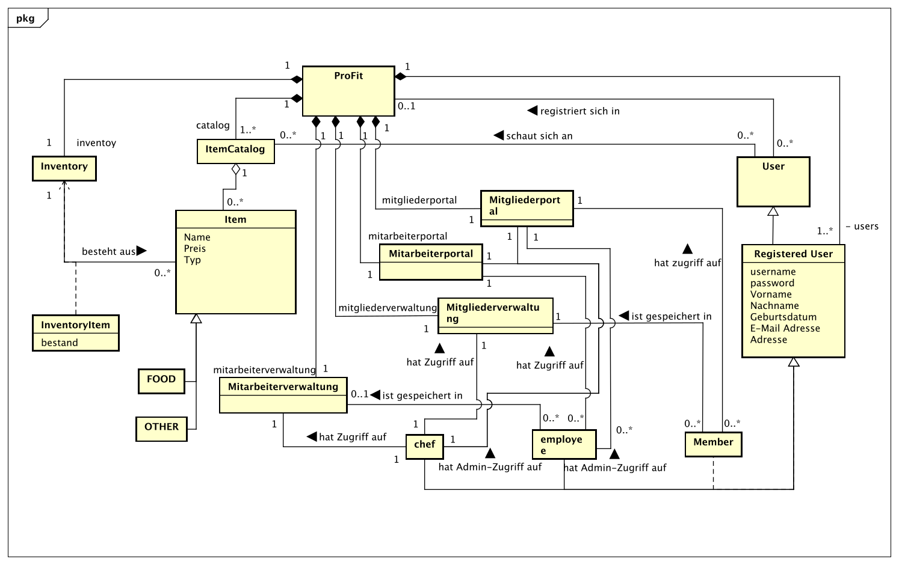

:project_name: ProFit Webseite
:imagesdir: images
:toc: left
:numbered:
= Pflichtenheft __{ProFit_Webseite}__

|===
|Version | Status      | Bearbeitungsdatum   | Autoren(en) |  Vermerk
|0.1     | In Arbeit   | 10.10.2021          | Autor       | Initiale Version
|===

== Zusammenfassung
Dieses Dokument beschreibt die Software Requirement Specifications (SRS) für das Projekt ProFit-Webseite. Es zielt darauf ab eine Übersicht über das zu erstellende Software Produkt und seine Funktionen, als eine Basis für die Kommunikation zwischen den Stakeholders des Projekts, den Nutzern und des Entwicklerteams. Das Ziel hinter diesem Dokument ist es, das fundament für die Zusammenarbeit zwischen Auftraggeber und Auftragnehmer zu bilden. Die SRS beschreibt welche Anforderungen das fertige Produkt zu erfüllen hat und wie der Auftragnehmer diese Umsetzen wird.

Allgemein soll die SRS Korrekt, Vollständig, Beständig (correct, complete, consistent; ccc) sein. Da es am Ende dafür genutzt werden soll, diese Ziele zu Validieren, muss es nachvollziebar sein. Um wärend des Entwicklungsprozesses Änderungen vornehmen zu können, soll die SRS möglichst einfach zu bearbeiten und zu entwickeln sein. Nachdem die Stakeholders das fertige Produkt akzeptiert haben, sollten nachfolgende Änderungen minimiert werden. Aber weil der Auftraggeber seine Anforderungen anpassen könnte, muss im Vorhinein mit Umstellungen gerechnet werden, welche Dokumentiert werden sollen. 

== Aufgabenstellung und Zielsetzung
Aufgabenstellung:
Das Fitnessstudio ProFit ist ein mittelgroßes Fitnessstudio in dem Herzen von Dresden. Es erfreut sich großer Beliebtheit und hat eine große Anzahl an Mitgliedern. Nun soll die Verwaltung des Studios digitalisiert werden, damit die Mitarbeiter und Mitglieder sich auf das Wesentliche konzentrieren können. Dabei sollen verschiedene Geschäftsfelder berücksichtigt werden.

Der Inhaber des Fitnessstudios (_Chef_) besitzt einen speziellen Login und ist für die Verwaltung des Equipments, wie auch der Mitarbeiter Zuständig. Er erstellt die zugehörigen Accounts der Mitarbeiter (_hireEmployee_), teilt ihnen ihre Rechte zu und vergibt ein Einmal-Passwort (_EntryPasswort_).

In der Mitarbeiterverwaltung können die Mitarbeiter (_Employee_) des Fitnessstudios (_ProFit_) eingestellt (_hireEmployee_), bearbeitet (_editEmployee_)und entlassen (_fireEmployee_) werden. Die Mitarbeiter haben verschiedene Eigenschaften: Name (_Name_), Alter (_Age_), Gehalt (_Salary_), Überstunden (_OverTime_). Ein Dienstplan (_WorkSchedule_) muss ebenfalls erstellt werden, es muss zu jeder Zeit mind. eine Thekenkraft (_CounterStaff_) und ein Trainer (_Trainer_) anwesend sein. Am Abend muss eine Reinigungskraft (_Cleaner_) für 1h eingetragen sein. Die Mitarbeiter sollen einen eigenen Login (_Login_) bekommen, um den Dienstplan zu betrachten und Urlaubsanträge (_VacationRequest_)zu stellen.
Es sollen ebenfalls alle Mitglieder (_Member_) verwaltet werden können. Eigenschaften: Name (_Name_), Geburtstag (_Birthday_), E-mail (_EMail_), Adresse (_Adress_), Einstieg (_SignUp_), Passwort (_Password_), PayPalKonto (_PayPal_). Diese können in dem Studio aufgenommen (_createMember_), bearbeitet (_updateMember_) und gekündigt (_deleteMember_) werden. Bei der Aufnahme soll ein Login (_Login_) erstellt werden, damit der Kunde von zu Hause aus seinen nächsten Trainingstermin (_TrainingDate_) samt Trainingsplan (_TrainingSchedule_) nachschlagen kann, Rechnungen (_Invoice_) betrachten kann und um persönliche Daten (_editData_) zu ändern . Für jedes Mitglied kann ein individueller Trainingsplan durch den Trainer erstellt werden.

Wirbt ein Mitglied ein neues Mitglied an, wird ihm ein bestimmter Betrag (_referralBonus_) auf sein Kundenkonto (_Account_) gutgeschrieben, welches er nur an der Theke (_Counter_) verbrauchen kann und nicht ausgezahlt wird.
Kunden (_Guest_), die zum ersten Mal das Studio besuchen, können mit einem Trainer ein Probetraining (_TrialTraining_) vereinbaren, entweder direkt im Studio oder über das Internetportal des Studios. Eine Mitgliedschaft kostet eine monatliche Gebühr (_Fee_) und kann pro Jahr für einen Monat ohne Gründe ausgesetzt werden. Am Ende des Monats wird für jeden Kunden eine Rechnung über sein Kundenkonto erstellt.

Des Weiteren gibt es einen Eingangs- und Verkaufsbereich (_Counter_). An der Theke können auch Getränke (_Drinks_), Nahrungsergänzungsmittel (_Supplements_) oder Zubehör (_Equipment_) erworben (_buy_) werden, diese werden bar bezahlt oder direkt vom Kundenkonto abgebucht. Die Artikel des Verkaufsbereiches müssen sich ebenfalls verwalten lassen. Es müssen Artikel (_Item_) hinzugefügt (_addItem_), bearbeitet (_editItem_) und gelöscht (_deleteItem_) werden können. Beim Unterschreiten der Mindestmenge (_MinimumQuantity_) müssen die Artikel für den Angestellten markiert (_flagItem_) werden, um nachbestellt (_reorderItem_) werden zu können. Artikel die für den Verzehr gedacht sind, haben ein Verfallsdatum (_ExpiryDate_), welches regelmäßig überprüft werden soll. Für verschiedene Artikel soll man feinen Rabatt (_Discount_) angeben können.
Ebenfalls sollen Statistiken (_Statistics_) über laufende Kosten (_Costs_), Einnahmen (_Profit_), Kundenverhalten (_MemberBehaviour_) und Verkaufsartikel (_SoldItems_) dargestellt werden. Verschiedene Einstellungen wie Vertragslaufzeit (_ContractRuntime_), monatliche Gebühren (_Fee_), Neuwerbungsprämie (_RecruitmentBonus_), Öffnungszeiten (_OpeningHours_), Rabatt usw. sollen sich einfach global, vom Chef, verändern lassen.

Zielsetzung:
Unser oberstes Ziel ist der termingerechte Abschluss des Projekts gemäß dem festgelegten Zeitplan. Als zentrales Ergebnis streben wir die Erstellung einer voll funktionalen Website an, die den Bedürfnissen der Nutzer optimal entspricht. Technisch legen wir großen Wert auf die Erstellung eines sauberen, verständlichen und gut strukturierten Codes, der leicht zu verwenden, zu modifizieren und zukünftig weiterzuentwickeln ist. Darüber hinaus ist uns ein übersichtliches und ansprechendes Design ein wichtiges Anliegen, um eine positive Nutzererfahrung zu gewährleisten. Schließlich wird der Gewährleistung der Datensicherheit höchste Priorität eingeräumt, um die Daten unserer Nutzer bestmöglich zu schützen.

== Produktnutzung
Das System wird über eine Schnittstelle genutzt, die als Webseite dargestellt und über das Internet mit gängigen Browsern wie Google Chrome und Firefox aufgerufen wird. Die Webseite ist 24/7 erreichbar.

Das System muss für folgende Browser zugänglich und visuell optimiert sein:
Google Chrome, Version 142.0.7390.52+
Firefox, Version 144.0.2+

Die Webseite ermöglicht es:

- Mitarbeitern des Fitnessstudios: Eingestellt, bearbeitet und entlassen zu werden, den Dienstplan einzusehen und Urlaubsanträge zu stellen.

- Mitgliedern: Im Studio aufgenommen, bearbeitet und gekündigt zu werden, Trainingstermine samt Trainingspläne nachzuschlagen, Rechnungen einzusehen und persönliche Daten zu ändern.

- Trainern: Personalisierte Trainingspläne für Mitglieder zu erstellen.

- Der Thekenkraft: Artikel hinzufügen, bearbeiten und löschen sowie die Preise der Produkte anpassen, um sie an Aktionsprogramme oder das Verfallsdatum der Produkte anzupassen.

Die Webseite verfügt über eine benutzerfreundliche und intuitive Benutzeroberfläche. Der Benutzer benötigt nicht unbedingt technisches Grundwissen.

== Interessensgruppen (Stakeholders)
Hier sind alle Gruppen oder Einzelpersonen (natürliche oder juristische Personen) aufgeführt, die Einfluss auf die Systemanforderungen haben.
In der folgenden Tabelle sind diese Stakeholder aufgelistet, ihnen wurde eine Priorität zugewiesen (dies erleichtert Entscheidungen, falls Anforderungen miteinander in Konflikt geraten)
und ihre übergeordneten Ziele werden beschrieben.

Die zugewiesenen Prioritäten reichen von 1 (niedrigste Priorität) bis 5 (höchste Priorität).

[options="header", cols="2, ^1, 4, 4"]
|===
| Name | Priorität (1..5) | Beschreibung | Ziele 
| Inhaber von ProFit | 5 | Der Auftraggeber und wichtigste Kunde dieses Projekts.| Digitalisieren der Administration des Fitnessstudios, Einfache Kundenverwaltung, Vorbeugung von fehlerhaftem Lagerbestand 
| Mitarbeiter | 4 | Die wichtigsten Nutzer dieser Webseite. Umfasst Trainer, Thekenkräfte und Putzkräfte | Einfach Verständliche/Übersichtliche und Bedienbare Webseite 
| Mitglieder | 4 | Die haupt Nutzer dieser Webseite, sollten zufrieden sein und Mitglied bleiben | Gute Nutzer-Erfahrung, Einfach bedienbare und übersichtliche Webseite 
| Gäste (Probetraining) | 3 | Zweitwichtigste Nutzergruppe, sollten Mitglieder werden | Allgemein ansprechende und informative Webseite 
| Entwickler | 3 | Personen, welche die Webseite Implementieren oder später für dessen Instandhaltung zuständig sind | Einfach Erweiterbare Webseite, Wenig Wartungs Aufwand, Gute debugging mechanismen 
| Administratoren | 2 | Nutzer, welche die Seite später verwalten sollen | Möglichkeit alle daten des Systems zu überblicken und zu bearbeiten 
|===

== Systemgrenze und Top-Level-Architektur

=== Kontextdiagramm
Das Kontextdiagramm zeigt das geplante Software-System in seiner Umgebung. Zur Umgebung gehören alle Nutzergruppen des Systems und Nachbarsysteme. Die Grafik kann auch informell gehalten sein. Überlegen Sie sich dann geeignete Symbole. Die Grafik kann beispielsweise mit Visio erstellt werden. Wenn nötig, erläutern Sie diese Grafik.

.Kontextdiagramm in UML

.Kontextdiagramm in C4 Notation
image::Kontext C4 Profit.png[]

=== Top-Level-Architektur

.Top Level Architektur in UML

.Top Level Architektur in C4 Notation
image::Component C4 ProFit.png[]

== Anwendungsfälle

=== Akteure

Akteure sind die Benutzer des Software-Systems oder Nachbarsysteme, welche darauf zugreifen. Dokumentieren Sie die Akteure in einer Tabelle. Diese Tabelle gibt einen Überblick über die Akteure und beschreibt sie kurz. Die Tabelle hat also mindestens zwei Spalten (Akteur Name und Kommentar).
Weitere relevante Spalten können bei Bedarf ergänzt werden.

// See http://asciidoctor.org/docs/user-manual/#tables
[options="header"]
[cols="1,4"]
|===
|Name |Beschreibung
|Benutzer  |Oberbegriff für alle Personen welche die Webseite nutzen, egal ob authentifiziert oder nicht.
|Registrierter (authentifizierter) Benutzer |Oberbegriff für alle Personen, welche einen account besitzen, eingeloggt sind und mit dem System interagieren.
|Unregestrierter Benutzer |Oberbegriff für alle Personen, welche noch keinen account besitzen ud nicht authentifiziert sind.
|Putzkraft  |Mitarbeiter (eigeteilt zur Reinigung)
|Trainer  |Mitarbeiter (eingeteilt für Geräte)
|Thekenkraft  |Mitarbeiter (eingeteilt für Verkauf an der Theke)
|Mitglied  |angemeldeter Kunde mit eingenem Kundenkonto
|Gast  |unangemeldeter/potentieller Kunde (für Buchung eines Probetrainings)
|Chef  |Führungsperson mit allen Rechten/ organisatorischen Fähigkeiten
|===

=== Überblick Anwendungsfalldiagramm
Anwendungsfall-Diagramm, das alle Anwendungsfälle und alle Akteure darstellt

image::UseCase Diagram2.0.svg[]

=== Anwendungsfallbeschreibungen
Dieser Unterabschnitt beschreibt die Anwendungsfälle. In dieser Beschreibung müssen noch nicht alle Sonderfälle und Varianten berücksichtigt werden. Schwerpunkt ist es, die wichtigsten Anwendungsfälle des Systems zu finden. Wichtig sind solche Anwendungsfälle, die für den Auftraggeber, den Nutzer den größten Nutzen bringen.
Für komplexere Anwendungsfälle ein UML-Sequenzdiagramm ergänzen.
Einfache Anwendungsfälle mit einem Absatz beschreiben.
Die typischen Anwendungsfälle (Anlegen, Ändern, Löschen) können zu einem einzigen zusammengefasst werden.

[cols="1h, 3"]
[[UC0010]]
|===
|ID                         |**<<UC0010>>**
|Name                       |Anmelden
|Beschreibung               |Ein registrierter Benutzer soll sich im System anmelden (authentifizieren) können, um auf weitere Funktionen zugreifen zu können. Dieser Vorgang kann durch Abmelden rückgängig gemacht werden.
|Akteure                    |Benutzer
|Auslöser                   |Der Benutzer möchte durch die Anmeldung auf „versteckte“ Funktionen zugreifen.
|Vorbedingung(en)           a|
|Essenzielle Schritte       a|
 1. Der Benutzer ruft den Menüpunkt „Einloggen“ in der Navigationsleiste auf.
 2. Der Benutzer gibt seine Zugangsdaten ein.
 3. Der Benutzer klickt auf die Schaltfläche „Anmelden“.
|Erweiterungen                |-
|Funktionale Anforderungen    |F002
|===

[cols="1h, 3"]
[[UC0011]]
|===
|ID                         |**<<UC0011>>**
|Name                       |Abmelden
|Beschreibung               |Ein authentifizierter Benutzer soll sich aus dem System abmelden können
|Akteure                    |Registrierter Benutzer
|Auslöser                   |Der Benutzer möchte das System verlassen
|Vorbedingung(en)          a|Der Benutzer ist authentifiziert
|Essenzielle Schritte      a|
 1. Der Benutzer klickt in der Navigationsleiste auf „Abmelden“.
 2. Der Benutzer ist nicht mehr authentifiziert und sieht die Startseite.
|Erweiterungen              |-
|Funktionale Anforderungen  |...
|===

[cols="1h, 3"]
[[UC0020]]
|===
|ID                         |**<<UC0020>>**
|Name                       |Registrierung
|Beschreibung               |Ein unregistrierter Benutzer soll sich einen Account erstellen können
|Akteure                    |Unregistrierter Benutzer
|Auslöser                   |Ein Unregistrierter Benutzer möchte einen Account für sich erstellen indem er auf "Registrieren" drückt
|Vorbedingung(en)          a|Akteur ist nicht Angemeldet
|Essenzielle Schritte      a|
 1. Nicht authentifizierter Benutzer klickt auf „Registrieren“.
 2. Er gibt seine gewünschten Daten an.
 3. Das System prüft, ob der Benutzername bereits vergeben ist.
 4. Falls der Benutzername noch nicht vergeben ist: Ein Konto wird mit den angegebenen Daten erstellt.
 5. Andernfalls: Eine Fehlermeldung wird angezeigt.
|Erweiterungen                |-
|Funktionale Anforderungen    |F001
|===

[cols="1h, 3"]
[[UC0100]]
|===
|ID                         |**<<UC0100>>**
|Name                       |Modelle ansehen
|Beschreibung               |Mitglieder und Gäste könenn sich die verfügbaren Abo-Modelle ansehen
|Akteure                    |Mitglied, Gast
|Auslöser                   |Ein Mitglied/Gast will die Abo-Modelle sehen
|Vorbedingung(en)          a|keine
|Essenzielle Schritte      a|
 1. Abo-Modelle anklicken
|Erweiterungen              |-
|Funktionale Anforderungen  |...
|===

[cols="1h, 3"]
[[UC0110]]
|===
|ID                         |**<<UC0110>>**
|Name                       |Warenkorb ansehen
|Beschreibung               |Artikel die gekauft werden möchten sehen
|Akteure                    |Mitglieder
|Auslöser                   |Mitglied möchte seinen Warenkorb sehen
|Vorbedingung(en)          a|Das Mitglied besitzt einen Account
|Essenzielle Schritte      a|
 1. auf Warenkorb klicken
|Erweiterungen              |-
|Funktionale Anforderungen  |...
|===

[cols="1h, 3"]
[[UC0200]]
|===
|ID                         |**<<UC0200>>**
|Name                       |Probetraining beantragen
|Beschreibung               |Ein Gast soll ein Probetraining beantragen können
|Akteure                    |Gast
|Auslöser                   |Ein Gast möchte ein Probetraining vereinbaren
|Vorbedingung(en)          a|-
|Essenzielle Schritte      a|
 1. Der Gast drückt auf "Probetraining beantragen" im Mitgliederportal.
 2. Das System prüft in der Probetrainings-Übersicht auf freie Termine.
 3. Der Gast wählt eine freie Zeit aus.
 4. Thekenkraft und Trainer werden darüber informiert.
|Erweiterungen              |-
|Funktionale Anforderungen  |F003
|===

[cols="1h, 3"]
[[UC0210]]
|===
|ID                         |**<<UC0210>>**
|Name                       |Kontodaten bearbeiten
|Beschreibung               |Ein Mitglied soll sein Konto bearbeiten können
|Akteure                    |Mitglied
|Auslöser                   |Ein Mitglied möchte sein Konto bearbeiten
|Vorbedingung(en)          a|Das Mitglied ist angemeldet
|Essenzielle Schritte      a|
 1. Das Mitglied drückt auf "Konto einsehen" im Mitgliederportal.
 2. Seine Konto Daten werden angezeigt.
|Erweiterungen              |-
|Funktionale Anforderungen  |F004
|===

[cols="1h, 3"]
[[UC0220]]
|===
|ID                         |**<<UC0220>>**
|Name                       |Bestellübersicht
|Beschreibung               |Ein Mitglied soll seine Bestullen sehen könnnen
|Akteure                    |Mitglied
|Auslöser                   |Ein Mitglied möchte seine alten Bestellungen sehen
|Vorbedingung(en)          a|Das Mitglied ist angemeldet
|Essentielle Schritte      a|
 1. Das Mitglied drückt auf "Meine Bestellungen" im Mitgliederportal.
 2. Seine Bestellungen werden angezeigt.
|Erweiterungen              |-
|Funktionale Anforderungen  |F004
|===

[cols="1h, 3"]
[[UC0230]]
|===
|ID                         |**<<UC0230>>**
|Name                       |Trainingsplan bearbeiten
|Beschreibung               |Ein Mitglied soll seinen Trainingsplan bearbeiten können
|Akteure                    |Mitglied
|Auslöser                   |Ein Mitglied möchte seinen Trainsplan bearbeiten
|Vorbedingung(en)          a|Das Mitglied ist angemeldet
|Essentielle Schritte      a|
 1. Das Mitglied drückt auf "Trainingsplan bearbeiten" im Mitgliederportal.
 2. Sein Trainingsplan wird angezeigt.
|Erweizerungen              |-
|Funktionale Anforderungen  |F004
|===

[cols="1h, 3"]
[[UC0300]]
|===
|ID                         |**<<UC0300>>**
|Name                       |Artikel bearbeiten
|Beschreibung               |Der Bestand des Verkaufsbereiches soll angesehen und die Artikel bearbeitet/ hinzugefügt werden können 
|Akteure                    |Chef, Thekenkraft
|Auslöser                   |Chef oder Thekenkraft möchten den Lagerbestand ansehen
|Vorbedingung(en)          a|Chef oder Thekenkraft muss angemeldet sein
|Essenzielle Schritte      a|
 1. Chef oder Thekenkraft drückt auf "Lagerbestand" im Bereich der Verkaufsverwaltung.
 2. Eine Bestandsliste wird angezeigt.
|Erweiterungen                |-
|Funktionale Anforderungen    |F104
|===

[cols="1h, 3"]
[[UC0310]]
|===
|ID                         |**<<UC0310>>**
|Name                       |Artikel sehen
|Beschreibung               |Welche Artikel es zu Kaufen gibt sehen
|Akteure                    |Mitglieder, Chef, Thekenkraft, Gast
|Auslöser                   |Chef, Thekenkraft, Mitglied, Gast möchte die Artikel im Shop sehen
|Vorbedingung(en)          a|Chef, Thekenkraft, Mitglied, Gast müssen angemedlet sein/ nicht
|Essenzielle Schritte      a|
 1. Chef, Thekenkraft, Mitglied, Gast drückt auf "Shop" im Bereich der Verkaufsverwaltung.
 2. Eine Artikel werden angezeigt.
|Erweiterungen                |-
|Funktionale Anforderungen    |...
|===

[cols="1h, 3"]
[[UC0320]]
|===
|ID                         |**<<UC0320>>**
|Name                       |Artikel in Warenkorb
|Beschreibung               |Artikel in den Warenkorb packen
|Akteure                    |Mitglieder
|Auslöser                   |Mitglied möchte Artikel kaufen
|Vorbedingung(en)          a|Mitglied muss angemeldet sein
|Essenzielle Schritte      a|
 1. Mitglied wählt anzahl
 2. Drückt auf zum Warenkorb hinzufügen 
|Erweiterungen                |-
|Funktionale Anforderungen    |...
|===

[cols="1h, 3"]
[[UC0400]]
|===
|ID                         |**<<UC0400>>**
|Name                       |Artikel kaufen
|Beschreibung               |Artikel kaufen
|Akteure                    |Mitglieder
|Auslöser                   |Mitglied möchte Artikel kaufen
|Vorbedingung(en)          a|Mitglied muss angemeldet sein und Artikel sind im Warenkorb
|Essenzielle Schritte      a|
 1. Mitglied fügt Artikel zum Warenkorb hinzu
 2. Drückt auf Kaufen und Bezahlen
|Erweiterungen                |-
|Funktionale Anforderungen    |...
|===

[cols="1h, 3"]
[[UC0410]]
|===
|ID                         |**<<UC0410>>**
|Name                       |Rechnung sehen/drucken
|Beschreibung               |Nach dem kauf die Rechnung sehen und drucken können
|Akteure                    |Mitglieder
|Auslöser                   |Mitglied möchte seine Rechnung sehen und drucken
|Vorbedingung(en)          a|Mitglied muss angemeldet sein und Artikel gekauft/bezahlt haben
|Essenzielle Schritte      a|
 1. Mitglied hat Artikel gekauft
 2. Drückt auf Rechnung anzeigen/ drucken
|Erweiterungen                |-
|Funktionale Anforderungen    |...
|===

[cols="1h, 3"]
[[UC0500]]
|===
|ID                         |**<<UC0500>>**
|Name                       |Bestellungen einsehen
|Beschreibung               |Der Chef möchte sehen was alles gekauft wurde 
|Akteure                    |Chef
|Auslöser                   |Mitglied möchte die gekauften Artikel sehen
|Vorbedingung(en)          a|Chef muss angemeldet sein
|Essenzielle Schritte      a|
 1. Chef drückt auf Bestellungen einsehen
|Erweiterungen                |-
|Funktionale Anforderungen    |F203
|===

[cols="1h, 3"]
[[UC0600]]
|===
|ID                         |**<<UC0600>>**
|Name                       |Mitglieder Trainingspläne sehen
|Beschreibung               |Der Chef oder Trainer kann dei Trainingspläne der Mitglieder einsehen 
|Akteure                    |Chef, Trainer
|Auslöser                   |Chef oder Trainer möchten den Trainingsplan eines Mitgliedes sehen und z.B. bearbeiten
|Vorbedingung(en)          a|Chef, Trainer muss angemeldet sein
|Essenzielle Schritte      a|
 1. Chef Trainer drückt auf Trainingsverwaltung
 2. Mitglied wählen
|Erweiterungen                |-
|Funktionale Anforderungen    |...
|===

[cols="1h, 3"]
[[UC0610]]
|===
|ID                         |**<<UC0610>>**
|Name                       |Mitglieder Trainingspläne bearbeiten
|Beschreibung               |Der Chef oder Trainer kann dei Trainingspläne der Mitglieder bearbeiten
|Akteure                    |Chef, Trainer
|Auslöser                   |Chef oder Trainer möchten den Trainingsplan eines Mitgliedes bearbeiten
|Vorbedingung(en)          a|Chef, Trainer muss angemeldet sein
|Essenzielle Schritte      a|
 1. Chef Trainer drückt auf Trainingsverwaltung
 2. Mitglied wählen
|Erweiterungen                |-
|Funktionale Anforderungen    |F102
|===

[cols="1h, 3"]
[[UC0700]]
|===
|ID                         |**<<UC0700>>**
|Name                       |Mitglieder bearbeiten
|Beschreibung               |Die Account Daten eines Mitglieds sollen bearbeitet/geändert werden können
|Akteure                    |Chef, Thekenkraft
|Auslöser                   |Die Account Daten eines Mitglieds sollen bearbeitet/geändert werden
|Vorbedingung(en)          a|Das Mitglied besitzt einen Account
|Essenzielle Schritte      a|
 1. Chef oder Thekenkraft drückt auf "Mitglieder Daten bearbeiten" in der Mitgliederverwaltung.
 2. Er ersetzt die alten mit den neuen gewünschten Daten.
 3. Er drückt auf "Bestätigen".
|Erweiterungen              |-
|Funktionale Anforderungen  |F103
|===

[cols="1h, 3"]
[[UC0710]]
|===
|ID                         |**<<UC0710>>**
|Name                       |Mitglieder löschen
|Beschreibung               |Eins existierendes Mitglied soll entfernt werden können
|Akteure                    |Chef, Thekenkraft
|Auslöser                   |Ein existierendes Mitglied soll entfernt werden
|Vorbedingung(en)          a|Das zu entfernende Mitglied hat einen Account
|Essenzielle Schritte      a|
 1. Chef oder Thekenkraft drückt auf "Mitglied kündigen" in der Mitgliederverwaltung.
 2. Der Account des ausgewählten Mitglieds wird gelöscht.
|Erweiterungen                |-
|Funktionale Anforderungen    |F103
|===

[cols="1h, 3"]
[[UC0720]]
|===
|ID                         |**<<UC0720>>**
|Name                       |Mitglieder erstellen
|Beschreibung               |Ein neuer Mitglieder Account soll Angelegt werden können
|Akteure                    |Chef, Thekenkraft
|Auslöser                   |Ein neuer Mitglieder-Account soll angelegt werden
|Vorbedingung(en)          a|Mitglied-to-be ist nicht angemeldet
|Essenzielle Schritte      a|
 1. Chef oder Thekenkraft drückt auf "Mitglieder hinzufügen" in der Mitgliederverwaltung.
 2. Er gibt die gewünschten Daten an.
 3. Das System prüft, ob der Benutzername bereits vergeben ist.
 4. Falls der Benutzername noch nicht vergeben ist: Ein Konto wird mit den angegebenen Daten erstellt.
 5. Andernfalls: Eine Fehlermeldung wird angezeigt.
|Erweiterungen              |-
|Funktionale Anforderungen  |F103
|===

[cols="1h, 3"]
[[UC0800]]
|===
|ID                         |**<<UC0800>>**
|Name                       |Urlaub beantworten
|Beschreibung               |Der Chef soll eine die Urlaubsanträge sehen und bewerten können
|Akteure                    |Chef
|Auslöser                   |Der Chef möchte die Urlaubs Anträge einsehen
|Vorbedingung(en)          a|Der Chef muss angemeldet sein
|Essenzielle Schritte      a|
 1. Der Chef drückt auf "Urlaubsanfragen" in der Mitarbeiterverwaltung.
 2. Eine Übersicht der kommenden Urlaube wird angezeigt.
|Erweiterungen                |-
|Funktionale Anforderungen    |...
|===

[cols="1h, 3"]
[[UC0810]]
|===
|ID                         |**<<UC0810>>**
|Name                       |Urlaub anfragen
|Beschreibung               |Trainer, Thekenkraft oder Putzkraft soll Urlaub beantragen können
|Akteure                    |Trainer, Thekenkraft oder Putzkraft
|Auslöser                   |Trainer, Thekenkraft oder Putzkraft möchte Urlaub beantragen
|Vorbedingung(en)          a|Trainer, Thekenkraft oder Putzkraft muss angemeldet sein
|Essenzielle Schritte      a|
 1. Trainer, Thekenkraft oder Putzkraft drückt auf "Urlaub beantragen" im Mitarbeiterportal.
 2. Er gibt den gewünschten Zeitraum an.
 3. Er drückt auf "Bestätigen".
 4. Der Chef wird über den Antrag informiert und kann diesen annehmen oder ablehnen.
|Erweiterungen                |-
|Funktionale Anforderungen    |F101
|===

[cols="1h, 3"]
[[UC0900]]
|===
|ID                         |**<<UC0900>>**
|Name                       |Mitarbeiter bearbeiten
|Beschreibung               |Der Chef soll den Account eines Mitarbeiters bearbeiten können
|Akteure                    |Chef
|Auslöser                   |Der Chef möchte einen Mitarbeiteraccount bearbeiten
|Vorbedingung(en)          a|Der Chef muss angemeldet sein
|Essenzielle Schritte      a|
 1. Chef drückt auf "Mitarbeiter bearbeiten" im Fenster eines Mitarbeiters in der Mitarbeiterverwaltung.
 2. Er ersetzt die alten mit den neuen gewünschten Daten.
 3. Er drückt auf "Bestätigen".
|Erweiterungen                |-
|Funktionale Anforderungen    |F201
|===

[cols="1h, 3"]
[[UC0910]]
|===
|ID                         |**<<UC0910>>**
|Name                       |Mitarbeiter erstellen
|Beschreibung               |Der Chef soll einen neuen Account für einen neuen Mitarbeiter erstellen können
|Akteure                    |Chef
|Auslöser                   |Der Chef möchte einen neuen Mitarbeiteraccount erstellen
|Vorbedingung(en)          a|Der Chef muss angemeldet sein
|Essenzielle Schritte      a|
 1. Chef drückt auf "Mitarbeiter einstellen" in der Mitarbeiterverwaltung.
 2. Er gibt die gewünschten Daten an.
 3. Das System prüft, ob der Benutzername bereits vergeben ist.
 4. Falls der Benutzername noch nicht vergeben ist: Ein Konto wird mit den angegebenen Daten erstellt.
 5. Andernfalls: Eine Fehlermeldung wird angezeigt.
|Erweiterungen                |-
|Funktionale Anforderungen    |F201
|===

[cols="1h, 3"]
[[UC0920]]
|===
|ID                         |**<<UC0920>>**
|Name                       |Mitarbeiter kündigen
|Beschreibung               |Der Chef soll den Account eines Mitarbeiters löschen können
|Akteure                    |Chef
|Auslöser                   |Der Chef möchte einen Mitarbeiteraccount löschen
|Vorbedingung(en)          a|Der Chef muss angemeldet sein
|Essenzielle Schritte      a|
 1. Chef drückt auf "Mitarbeiter kündigen" im Fenster eines Mitarbeiters in der Mitarbeiterverwaltung.
 2. Der gewählte Mitarbeiteaccount wird gelöscht.
|Erweiterungen                |-
|Funktionale Anforderungen    |F201
|===

[cols="1h, 3"]
[[UC1000]]
|===
|ID                         |**<<UC1000>>**
|Name                       |Dienstsplan einsehen
|Beschreibung               |Trainer, Thekenkraft oder Putzkraft soll den Dienstplan der Woche einsehen können
|Akteure                    |Trainer, Thekenkraft, Putzkraft
|Auslöser                   |Trainer, Thekenkraft oder Putzkraft möchter seinen Dienstplan der Woche einsehen
|Vorbedingung(en)          a|Trainer, Thekenkraft oder Putzkraft muss angemeldet sein
|Essenzielle Schritte      a|
 1. Trainer, Thekenkraft oder Putzkraft drückt auf "Dienstplan einsehen" im Mitarbeiterportal.
 2. Der Dienstplan der gewählten Woche wird angezeigt.
|Erweiterungen                |-
|Funktionale Anforderungen    |F101
|===

[cols="1h, 3"]
[[UC1010]]
|===
|ID                         |**<<UC1010>>**
|Name                       |Dienstplan erstellen
|Beschreibung               |Der Chef soll den Dienstplan erstellen können
|Akteure                    |Chef
|Auslöser                   |Der Chef möchte eine neue Schicht erstellen
|Vorbedingung(en)          a|Der Chef muss angemeldet sein
|Essenzielle Schritte      a|
 1. Der Chef drückt auf "Diesntplan" in der Mitarbeiterverwaltung.
 2. Er erstellt eine neue Schicht mit Trainer und Thekenkraft.
 3. Er drückt auf "Bestätigen".
|Erweiterungen                |-
|Funktionale Anforderungen    |F202
|===

[cols="1h, 3"]
[[UC1020]]
|===
|ID                         |**<<UC1020>>**
|Name                       |Dienstplan bearbeiten
|Beschreibung               |Der Chef soll den Dienstplan bearbeiten können
|Akteure                    |Chef
|Auslöser                   |Der Chef möchte den Dienstplan bearbeiten
|Vorbedingung(en)          a|Der Chef muss angemeldet sein
|Essenzielle Schritte      a|
 1. Der Chef drückt auf "Diesntplan" in der Mitarbeiterverwaltung.
 2. Er ersetzt den alten mit dem neuen Dienstplan.
 3. Er drückt auf "Bestätigen".
|Erweiterungen                |-
|Funktionale Anforderungen    |F202
|===

[cols="1h, 3"]
[[UC1100]]
|===
|ID                         |**<<UC1000>>**
|Name                       |Statistiken einsehen
|Beschreibung               |Der Chef soll die Statistiken der Ein- und Ausgaben einsehen können
|Akteure                    |Chef
|Auslöser                   |Der Chef möchte die Statistiken der Ein- und Ausgaben einsehen
|Vorbedingung(en)          a|Der Chef muss angemeldet sein
|Essenzielle Schritte      a|
 1. Der Chef drückt auf "Finanzen und Statistiken" im Abschnitt "Finanzen und Statistik".
 2. Die Diagramme über die Ein- und Ausgaben werden angezeigt.
|Erweiterungen                |-
|Funktionale Anforderungen    |F203
|===

[cols="1h, 3"]
[[UC1200]]
|===
|ID                         |**<<UC1200>>**
|Name                       |Rabatt ändern
|Beschreibung               |Der Chef soll global die höhe des Rabatts anpassen können
|Akteure                    |Chef
|Auslöser                   |Der Chef möchte den Rabatt anpassen
|Vorbedingung(en)          a|Der Chef muss angemeldet sein
|Essenzielle Schritte      a|
 1. Der Chef drückt auf "Rabatt ändern" im Abschnitt der Globalen EInstellungen.
 2. Er ersetzt den alten mit dem neuen gewünschten Betrag.
 3. Er drückt auf "Bestätigen".
|Erweiterungen                |-
|Funktionale Anforderungen    |F104
|===

[cols="1h, 3"]
[[UC1210]]
|===
|ID                         |**<<UC1210>>**
|Name                       |Öffnungszeiten ändern
|Beschreibung               |Der Chef soll global die Öffnungszeiten anpassen können
|Akteure                    |Chef
|Auslöser                   |Der Chef möchte die Öffnungszeiten anpassen
|Vorbedingung(en)          a|Der Chef muss angemeldet sein
|Essenzielle Schritte      a|
 1. Der Chef drückt auf "Rabatt ändern" im Abschnitt der Globalen EInstellungen.
 2. Er ersetzt den alten mit dem neuen gewünschten Betrag.
 3. Er drückt auf "Bestätigen".
|Erweiterungen                |-
|Funktionale Anforderungen    |F204
|===

[cols="1h, 3"]
[[UC1220]]
|===
|ID                         |**<<UC1220>>**
|Name                       |Neuwerbungsprämie ändern
|Beschreibung               |Der Chef soll global die Neuwerbungsprämie anpassen können
|Akteure                    |Chef
|Auslöser                   |Der Chef möchte die Neuwerbungsprämie anpassen
|Vorbedingung(en)          a|Der Chef muss angemeldet sein
|Essenzielle Schritte      a|
 1. Der Chef drückt auf "Neuwerbungsprämie" im Abschnitt der Globalen EInstellungen.
 2. Er ersetzt den alten mit dem neuen gewünschten Betrag.
 3. Er drückt auf "Bestätigen".
|Erweiterungen                |-
|Funktionale Anforderungen    |F005
|===

[cols="1h, 3"]
[[UC1230]]
|===
|ID                         |**<<UC1230>>**
|Name                       |Creator Provision
|Beschreibung               |Der Chef soll global die Creator Provision anpassen können
|Akteure                    |Chef
|Auslöser                   |Der Chef möchte die Creator Provision anpassen
|Vorbedingung(en)          a|Der Chef muss angemeldet sein
|Essenzielle Schritte      a|
 1. Der Chef drückt auf "CreatorProvision" im Abschnitt der Globalen EInstellungen.
 2. Er ersetzt den alten mit dem neuen gewünschten Betrag.
 3. Er drückt auf "Bestätigen".
|Erweiterungen                |-
|Funktionale Anforderungen    |...
|===

[cols="1h, 3"]
[[UC1300]]
|===
|ID                         |**<<UC1300>>**
|Name                       |Creator-Code löschen
|Beschreibung               |Der Chef soll Creator-Codes löschen können
|Akteure                    |Chef
|Auslöser                   |Der Chef möchte einen Creator-Code löschen
|Vorbedingung(en)          a|Der Chef muss angemeldet sein
|Essenzielle Schritte      a|
 1. Der Chef drückt auf "Creator-Code Verwaltung" im Abschnitt der Chef Übersicht.
 2. Er löscht einen Code.
|Erweiterungen                |-
|Funktionale Anforderungen    |...
|===

[cols="1h, 3"]
[[UC1310]]
|===
|ID                         |**<<UC1310>>**
|Name                       |Creator-Code erstellen
|Beschreibung               |Der Chef soll Creator-Codes erstellen können
|Akteure                    |Chef
|Auslöser                   |Der Chef möchte einen neuen Creator-Code erstellen
|Vorbedingung(en)          a|Der Chef muss angemeldet sein
|Essenzielle Schritte      a|
 1. Der Chef drückt auf "Creator-Code Verwaltung" im Abschnitt der Chef Übersicht.
 2. Der Chef gibt ein Mitglied an, Code namen und die höhe des Rabatts.
 3. Mit "Code zuweisen" bestätigen
|Erweiterungen                |-
|Funktionale Anforderungen    |...
|===

== Funktionale Anforderungen

=== Muss-Kriterien
Was das zu erstellende Programm auf alle Fälle leisten muss.

[options="header", cols="1, 1, 2, 8"]
|===
|ID|Version|Name|Beschreibung

|F0xx
|-
|-
|Auf Funktionen der Form F0xx können alle zugreifen, Kunden, Mitarbeiter und der Chef

|F001
|v0.1
|Registrierung
a|Erlaubt es einem Benutzer ein Konto anzulegen. 
  Zu dieser Seite gelangt man über einen Button in der Menüleiste. 
  Um sich zu registrieren muss er folgende Informationen angeben:

* E-Mail Adresse
* Name
* Passwort
* Passwort bestätigen
* (Optional) Anwerber

|F002
|v0.1
|Anmeldung
a|Zu dieser Seite gelangt man über einen Button auf der Menüleiste. Hier können sich Nutzer anmelden. Falls man noch kein Kunde ist gibt es hier auch einen Button der zur Registrieren Seite(F001) führt. Dafür müssen sie folgende Daten bereitstellen:

* E-Mail Adresse
* Passwort

|F003
|v0.1
|Probetraining vereinbaren
a|Auf dieser Seite können Nutzer ein Probetraining beantragen. Dafür benötigt man kein Kundenkonto. Zudem können die Mitarbeiter auch hier ein Probetrining für einen Kunden im Studio vereinbaren. Um ein Probetraining zu buchen werden folgende Informationen benötigt:

* Name
* E-Mail Adresse
* Datum und Zeitwunsch

|F004
|v0.1
|Mitgliederportal
a|Registrierte Mitglieder sehen hier: 

* ihren Trainingsplan
* ihre Rechnungen  

Zudem können sie hier ihre Persönlichen Daten bearbeiten. Falls ein nicht angemeldetes Mitglied versucht auf diese seite zu gelandgen wird es auf die Login Seite(F002) geschickt.

|F005
|v0.1
|Kundenkonto
a|Hier werden Daten gespeichert/verwaltet wie:

* Gutschrift für neu angeworbene Kunden
* Sammlung der monatlichen Gebühr + Betrag der Einkäufe
* Betrag der Abbuchung am Ende des Monats

|F1xx
|-
|-
|Auf alle Funktionen der Form F1xx dürfen nur Mitarbeiter und Chef zugreifen

|F101
|v0.1
|Mitarbeiterportal
a|Hier können die Mitarbeiter ihren Dienstplan einsehen und Urlaubsanträge stellen. Um auf diese Seite zu gelangen müssen sich die Mitarbeiter erst identifizieren in F002. Hierfür brauchen sie:

* Mitarbeiter-ID
* Passwort

|F102
|v0.1
|Trainingsverwaltung
a|Hier kann ein Trainer einen Trainingsplan erstllen und bereits vorhandene bearbeiten.

|F103
|v0.1
|Mitgliederverwaltung
a|Hierauf können Mitarbeiter nach ihrem Login zugreifen. Dort können sie:

* Mitglieder aufnehmen
* Mitglieder bearbeiten
* Mitglieder kündigen

|F104
|v0.1
|Verkaufsverwaltung
a|Erlaubt es den Mitarbeitern Artikel zu verwalten. Das bedeutet konkret, sie können hier:

* Artikel hinzufügen (mit Mindestmenge, mit Haltbarkeitsdatum falls vorhanden)
* Artikel bearbeiten
* Artikel löschen
* Rabatt festlegen
* Artikel verkaufen(sowohl Bar als auch mit Guthaben auf dem Kundenkonto)

Zudem wird hier eine Warnung ausgegeben wenn die Mindestmenge eines Artikels unterschritten wird.

|F2xx
|-
|-
|Auf alle Funktionen der Form F2xx darf nur der Chef zugreifen!

|F201
|v0.1
|Mitarbeiterverwaltung
a|Zu diesem Bereich hat nur der Chef Zugriff. Hier kann er:

* Mitarbeiter einstellen und ihre Rolle bearbeiten(Reinigungskraft oder Trainer/Thekenkraft)
* Mitarbeiter bearbeiten 
* Mitarbeiter entlassen

|F202
|v0.1
|Dienstplan 
a|Hier kann der Chef den Dienstplan erstellen bzw bearbeiten. Auf diese Seite kommt man nur über einen Button der nur erscheint, wenn man als Chef eingeloggt ist. Die folgenden Kriterien sind beim erstellen zu beachten:

* Immer mindestens 1 Trainer und 1 Thekenkraft zur gleichen Zeit
* Zuordnung der Mitarbeiter, welche Rolle er an diesem Tag hat
* Putzkraft für 1h nach Schließung des Studios

|F203
|v0.1
|Statistiken
a|Auf dieser Seite hat der Chef eine Übersicht auf die wichtigsten Statistiken. Dies beinhaltet: 

* Die laufenden Kosten 
* Einnahmen 
* Das Kundenverhalten
* Die Verkaufsartikel(Bestand, Preis)

|F204
|v0.1
|Einstellungen
|Hier bearbeitet der Chef die Vertragslaufzeit, die monatlichen Gebühren für die Mitgliedschaft, die Höhe der Neuwerbungsprämie und er kann die Öffnungszeiten ändern.

|===

=== Kann-Kriterien
Anforderungen die das Programm leisten können soll, aber für den korrekten Betrieb entbehrlich sind.

[options="header", cols="1, 1, 2, 8"]
|===
|ID|Version|Name|Beschreibung

|E001
|v0.1
|Pause der Mitgliedschaft
a|Hier können Kunden eine Pause ihrer Mitgliedschaft beantragen(1 Monat). In dieser Pause wird kein monatlicher Betrag fällig. Dadurch verschiebt sich allerdings auch die Vertragslaufzeit um 1 Monat. Der Vertrag läuft dann beispielsweise nicht mehr bis Januar 2026, sondern aufgrund der Pause bis Februar 2026.

|E101
|v0.1
|Extra Rabatte
a|Kunden können extra Rabatte haben, z.B. zu ihrem Geburtstag oder ein Premium Kunde.

|E102
|v0.1
|Einzelne Rabatte
a|Hier können Mitarbeiter einzelnen Artikeln einen Rabatt geben.

|E201
|v0.1
|Stoßzeiten
a|Hier kann der Chef Stoßzeiten einstellen. Zu diesen Zeiten sollen mehr Mitarbeiter im Dienstplan eingeteilt werden.

|===

== Nicht-Funktionale Anforderungen

=== Qualitätsziele

Dokumentieren Sie in einer Tabelle die Qualitätsziele, welche das System erreichen soll, sowie deren Priorität.

=== Konkrete Nicht-Funktionale Anforderungen

Beschreiben Sie Nicht-Funktionale Anforderungen, welche dazu dienen, die zuvor definierten Qualitätsziele zu erreichen.
Achten Sie darauf, dass deren Erfüllung (mindestens theoretisch) messbar sein muss.

== GUI Prototyp

In diesem Kapitel soll ein Entwurf der Navigationsmöglichkeiten und Dialoge des Systems erstellt werden.
Idealerweise entsteht auch ein grafischer Prototyp, welcher dem Kunden zeigt, wie sein System visuell umgesetzt werden soll.
Konkrete Absprachen - beispielsweise ob der grafische Prototyp oder die Dialoglandkarte höhere Priorität hat - sind mit dem Kunden zu treffen.

=== Überblick: Dialoglandkarte
Erstellen Sie ein Übersichtsdiagramm, das das Zusammenspiel Ihrer Masken zur Laufzeit darstellt. Also mit welchen Aktionen zwischen den Masken navigiert wird.
//Die nachfolgende Abbildung zeigt eine an die Pinnwand gezeichnete Dialoglandkarte. Ihre Karte sollte zusätzlich die Buttons/Funktionen darstellen, mit deren Hilfe Sie zwischen den Masken navigieren.

image::Gesamze Dialogkarte.svg[]

- Dialogkarte Gesamte Karte.

image::Chef Dialogkarte.svg[]

- Dialogkarten: Ausschitt des Chefs

image::Mitglieder Dialogkarte.svg[]

- Dialogkarten: Ausschitt der Mitglieder

- Dialogkarten: Ausschitt der Trainer

image::Thekenkraft Dialogkarte.svg[]

- Dialogkarten: Ausschitt der Thekenkraft

- Dialogkarten: Ausschitt des Cleaners

image::Trainer Dialogkarte.svg[]

- Dialogkarten: Ausschitt des Gast

=== Dialogbeschreibung
Für jeden Dialog:

image::Startseite ohne anmeldung.png[]

- Start Seite wenn man ohne anmeldung auf die Webseite kommt

image::Anmelden.png[]

- Das Anmelde-Formular

image::Passwort zuruecksetzen.png[]

- Wenn der Nutzer sein Passwort vergessen hat kan er sich eine E-Mail senden lassen und es ändern.

image::Registrieren .png[]

- Das Registrier-Formular. Für neue Leute

image::Navigation Mitglieder.png[]

- Erste Seite die angezeigt, wenn sich ein Mitglied/Gast anmeldet

image::Navigation Trainer.png[]

- Erste Seite die angezeigt, wenn sich ein Trainer anmeldet

image::Navigation Thekenkraft.png[]

- Erste Seite die angezeigt, wenn sich eine Thekenkraft anmeldet

image::Navigation Cleaner.png[]

- Erste Seite die angezeigt, wenn sich ein Cleaner anmeldet

image::Navigation Chef.png[]

- Erste Seite die angezeigt, wenn sich der Chef anmeldet

image::Abo-Modelle mit Acc.png[]

- Auf dieser Seite sieht man die Verfügbaren Abo-Modelle. Wenn man einen Account hat

image::Abo-Modelle ohne acc.png[]

- So sieht es aus, wenn man keine Account hat 

image::Shop ohne acc.png[]

-Shopansicht für nicht Registrierte

image::Shop Mitglied.png[]

- Auf dieser Seite sieht man den Shop. Sichtbar für alle, außer den Chef und Thekenkraft, da anders.

image::Lagerbestand.png[]

- Shop Ansicht des Chefs und der Thekenkraft. Diese können Artikel bearbeiten und neue hinzufügen

image::Neuen Artikel hinzufuegen.png[]

- Hier können neue Artikel hinzugefügt werden

image::Artikel bearbeiten.png[]

- Hier können Artikel bearbeitet werden. Es könne z.B. Bestände aktualisiert oder Preise angepasst werden

image::Mitgliederverwaltung.png[]

- Verwaltung der Mitglieder für den Chef und die Thekenkraft

image::Neues Mitglied anlegen.png[]

- Neues Mitglied anlegen und der Liste hinzufügen durch bestätigen

image::Mitglied bearbeiten.png[]

- Bestehende Mitglieder bearbeiten, falls es änderungen der Daten gibt und dann wieder speichern

image::Mitarbeiterverwaltung.png[]

- Verwaltung der Mitarbeiter nur für den Chef

- Neue Mitarbeiter anlegen und der Liste hinzufügen durch bestätigen

- Bestehende Mitarbeiter bearbeiten, falls es änderungen der Daten gibt und dann wieder speichern

- Wenn ein Mitarbeiter, Mitglied oder Artikel gelöscht werden soll, kommt vor dem löschen nochmal eine Frage nach der bestätigung

image::Trainingsverwaltung.png[]

- Übersicht über die Trainingspläne der Mitglieder für Chef und Trainer

image::Trainingsplan.png[]

- Übersucht über eigenes Training eines Mitgliedes

image::Training hinzufuegen.png[]

- Eine neue Trainingseinheit dem Plan hinzufügen

image::Uebung hinzufuegen.png[]

- ein Bestehendes Training bearbeiten

image::Uebersicht aller Bestellungen.png[]

- Hier sieht der Chef alle dinge die die Mitglieder gekauft haben 

image::Meine Bestellungen.png[]

- Hier sehen die Mitglieder ihre eigennen Bestellungen 

image::Diensplan Chef.png[]

-Dienstplan sicht des Chefs. Er kan bearbeiten 

image::Neue Schicht erstellen.png[]

- Neue Schicht erstellen

image::Putzschicht erstellen.png[]

-Putzschicht hinzufügen

image::Dienstplan Mitarbeiter.png[]

-So sehen die Mitarbeiter den Dienstplan

image::Urlaubsanfragen der Mitarbeiter.png[]

- Hier sieht der Chef alle unbeantworteten Urlaubsanfragen der Mitarbeiter und kann diese annehmen oder ablehnen 

image::Urlaube.png[]

- Hier sehe die Mitarbeiter ihre Anfragen und wie der Status ist

image::Urlaub beantragen .png[]

- in diesem MenÜ können die Mitarbeiter ihren Urlaub beantragen

image::Finanz-und Statistikuebersicht.png[]

-Übersicht über die Statistiken

image::Globale Einstellungen.png[]

-Übersicht über die Aktuellen Einstellungen

image::Globale Einstellungen bearbeiten.png[]

-Aktuelle Einstellungen ändern

image::Creator-Code Verwaltung.png[]

-Creator-Code ändern

image::Kaufen.png[]

-Ansicht der Bestellübersicht

image::Rechnung.png[]

- Rechnung nach einem erfolgreichen Einkauf

image::Warenkorb ohne inhalt.png[]

- leerer warenkorb

image::Probetraining beantragen.png[]

- Übersicht über verfügbare ProbeTrainings

image::Meine Probetrainings.png[]

- Mein Gebuchtes Probetraining

== Datenmodell

=== Überblick: Klassendiagramm

UML-Analyseklassendiagramm

=== Klassen und Enumerationen
Dieser Abschnitt stellt eine Vereinigung von Glossar und der Beschreibung von Klassen/Enumerationen dar. Jede Klasse und Enumeration wird in Form eines Glossars textuell beschrieben. Zusätzlich werden eventuellen Konsistenz- und Formatierungsregeln aufgeführt.

// See http://asciidoctor.org/docs/user-manual/#tables
[options="header"]
|===
|Klasse/Enumeration    |Beschreibung 
|User                  |Ist die Darstellung einer realen Person            
|Registered User       |Ist eine repräsentation einer realen Person welche im System gespeichert ist 
|Member                |Ist ein als Mitglied registrierter User   
|Chef                  |Ist ein als Chef registrierter User 
|Employee              |Ist ein als Mitarbeietr registrierter User 
|ItemCatalog           |Ist eine Gruppierung von verkäuflichen Items
|Item                  |Representiert einen Gegenstand im Online-Catalog 
|Food                  |Ist ein essbares Produkt im Online-Shop
|Others                |Sind Items im Online-Shop die kein essen sind
|Inventory             |Stellt den Bestand der Items im ItemCatalog dar
|Inventory-Item        |Stellt die anzahl der verfügbaren Items im inventory dar
|Vacation              |Der Urlaub den Mitarbeiter beantragen können 
|Exercise              |Steht für einzelne Übungen die man im Training machen kann
|Training Day          |Sind die Wochentage an denen geöffnet ist
|Trainingsplan         |Wann ist welchen Training 
|Trainingsplanitem     |Ein Training mit Übung, Gewicht, Wiederholugen, Tag
|TrailTraining         |Probetrainig für gäste um das Gym an einem Tag zu testen
|Shift                 |Eine Dienstschicht mit Mitarbeiter und Zeit
|Abo Plan              |Länge/Art eines Abos
|Creator Code          |Möglichkeit für den Chef wichtigen Mitglieder eine Beteiligung an Bestellungen zu geben

|===

== Akzeptanztestfälle
Mithilfe von Akzeptanztests wird geprüft, ob die Software die funktionalen Erwartungen und Anforderungen im Gebrauch
erfüllt.
Diese sollen und können aus den Anwendungsfallbeschreibungen und den UML-Sequenzdiagrammen abgeleitet werden.
D.h., pro (komplexen) Anwendungsfall gibt es typischerweise mindestens ein Sequenzdiagramm (, welches ein
Szenarium beschreibt). Für jedes Szenarium sollte es einen Akzeptanztestfall geben. Listen Sie alle Akzeptanztestfälle in tabellarischer Form auf.
Jeder Testfall soll mit einer ID versehen werde, um später zwischen den Dokumenten (z.B. im Test-Plan) referenzieren zu können.

// See http://asciidoctor.org/docs/user-manual/#tables
[options="header"]
|===
|ID | **<<AT0010>>**
|Use Case| **<<UC0010>>**
|Vorbedingung| Das System hat existierende User
|Geschehen | Ein unverifizierter User kommt auf die Anmeldeseite und gibt dei richtigen anmelde Daten ein 
|Erwartetes Resultat | Der User ist unter seinem Namen authentifiziert
Er hat kommt auf den Home-Bildschirm
Er hat vollen Zugriff auf das System (abhängig von seiner Rolle)
|===

|===
|ID | **<<AT0011>>**
|Use Case| **<<UC0011>>**
|Vorbedingung| Ein Verifizierter User nutzt das System
|Geschehen | Er drückt den abmelde Button
|Erwartetes Resultat | Er wird abgemeldet; Er verliert seinen Zugriff 
|===

|===
|ID | **<<AT0020>>**
|Use Case| **<<UC0020>>**
|Vorbedingung| Ein nicht verifiezierter User nutzt das System
|Geschehen | Er geht zu Registrierung und gibt seine Daten ein (Name, Passwort, Email,...) und drückt auf den Button Registrieren
|Erwartetes Resultat | Es wird ein Verifiezierter User angelegt als Member 
|===

|===
|ID |  **<<AT0100>>**
|Use Case| **<<UC0100>>**
|Vorbedingung| Ein Gast oder angemeldetes Mitglied sind da
|Geschehen | Der Gast/Mitglied drückt auf Abo-Modelle
|Erwartetes Resultat | Die verfügbaren Abo-Modelle werden angezeigt
|===

|===
|ID | **<<AT0110>>**
|Use Case| **<<UC0110>>**
|Vorbedingung| Ein registriertes Mitglied ohne Abo oder ein Gast sind angemeldet
|Geschehen | Nutzer fügt Abo-Model dem Warenkorb hinzu
|Erwartetes Resultat | Abo-Modell wird im Warenkorb angezeigt
|===

|===
|ID | **<<AT0200>>**
|Use Case| **<<UC0200>>**
|Vorbedingung| ein Mitglied ohne Mitgliedschaft oder Gast sind angemeldet
|Geschehen | Wählen ein Probetraining aus 
|Erwartetes Resultat | Probetraining wird aus der Liste verfügbarer entfernt und im Dienstplan eingetragen  
|===

|===
|ID | **<<AT0210>>**
|Use Case| **<<UC0210>>**
|Vorbedingung| ein Mitglied oder gast mit einem Konto sind angemeldet 
|Geschehen | Drücken aus Konto einsehen und bearebiten ihre Daten
|Erwartetes Resultat | Daten werden gespeichert und im der Mitgliederverwaltung angezeigt
|===

|===
|ID | **<<AT0220>>**
|Use Case| **<<UC0220>>**
|Vorbedingung| ein Mitglied mit einem Laufenden Account meldet sich an
|Geschehen | Drücken aus Meine Bestellungen
|Erwartetes Resultat | List der eigennen Bestellungen wird angezeigt
|===

|===
|ID | **<<AT0230>>**
|Use Case| **<<UC0230>>**
|Vorbedingung| ein Mitglied mit einem Laufenden Account meldet sich an
|Geschehen | Drücken aus Trainingsplan; Bearbeitet die Trainigseinheiten
|Erwartetes Resultat | Neue Trainings werden gepsichert und im Trainingsplan angezeigt 
|===

|===
|ID | **<<AT0300>>**
|Use Case| **<<UC0300>>**
|Vorbedingung| Ein als Chef oder Thekenkraft registrierter Nutzer ist angemeldet
|Geschehen | Der Nutzer geht in den Shop und beabeitet Artikel
|Erwartetes Resultat | Die neuen Artikel werden im Shop angezeigt 
|===

|===
|ID | **<<AT0310>>**
|Use Case| **<<UC0310>>**
|Vorbedingung| Ein als Mitglied/Gast registrierter Nutzer ist und nicht registrierte Nutzer 
|Geschehen | Der Nutzer geht in den Shop 
|Erwartetes Resultat | Die neuen Artikel werden angezeigt  
|===

|===
|ID | **<<AT0320>>**
|Use Case| **<<UC0320>>**
|Vorbedingung| Ein als Mitglied registrierter Nutzer
|Geschehen | Der Nutzer geht in den Shop  und wählt artikel aus und fügt diese in dem Warenkorb
|Erwartetes Resultat | Die Artikel werden im Warenkorb angezeigt 
|===

|===
|ID |  **<<AT0400>>**
|Use Case| **<<UC0400>>**
|Vorbedingung| Ein als Mitglied registrierter nutzer hat Artikel im Warenkorb
|Geschehen | Das MItgliede drückt auf bezahlen
|Erwartetes Resultat | Die Arikel werden gekauft und im Lagerbestand abgezogen und der Betrag von Kunden abgezogen
|===

|===
|ID | **<<AT0410>>**
|Use Case| **<<UC0410>>**
|Vorbedingung| Ein als Mitglied registrierter nutzer hat Artikel gekauft 
|Geschehen | Das Mitglied drückt auf Rechnung drucken
|Erwartetes Resultat | Die Rechung wird im drucker Menü angezeigt 
|===

|===
|ID | **<<AT0500>>**
|Use Case| **<<UC0500>>**
|Vorbedingung| Ein als Chef registrierter User nutzt das System
|Geschehen | Ein als Chef registrierter User drückt Bestellungen einsehen
|Erwartetes Resultat | Alle Bestllungen werden angezeigt 
|===

|===
|ID | **<<AT0600>>**
|Use Case| **<<UC0600>>**
|Vorbedingung| Ein Verifizierter User nutzt das System
|Geschehen | Der Chef und der Trainer drücken auf die auf Trainingsverwaltung und wählen ein Mitglied
|Erwartetes Resultat | Der Trainingsplan des Mitgliedes wird angezeigt 

|===

|===
|ID |
|Use Case| **<<UC0610>>**
|Vorbedingung| Ein Verifizierter User nutzt das System
|Geschehen | Der Chef oder ein Trainer bearbeitet einen Trainingsplan eines Mitgliedes
|Erwartetes Resultat | Der Trainingsplan wird aktualisiert und und bei dem Mitgliedern auch angezeigt 
|===

|===
|ID | **<<AT0700>>**
|Use Case| **<<UC0700>>**
|Vorbedingung| Ein Verifizierter User nutzt das System
|Geschehen | Der Chef oder eine Thekenkraft bearbeitet die daten eines Mitgliedes
|Erwartetes Resultat | Die neuen daten werden gespeicehrt und in der Mitgliederverwaltung angezeigt 
|===

|===
|ID | **<<AT0710>>**
|Use Case| **<<UC0710>>**
|Vorbedingung| Ein Verifizierter User nutzt das System
|Geschehen | Der Chef oder eine Thekenkraft löschen ein Mitglied
|Erwartetes Resultat | Das Mitglied wird aus der Datenbank gelöscht und kann sich nicht mehr anmelden 
|===

|===
|ID | **<<AT0720>>**
|Use Case| **<<UC0720>>**
|Vorbedingung| Ein Verifizierter User nutzt das System
|Geschehen | Ein Chef oder Thekenkraft erstellt einen Member
|Erwartetes Resultat | Der neue Member wird in der Mitgliederverwaltung angezeigt und kann sich anmelden  
|===

|===
|ID | **<<AT0800>>**
|Use Case| **<<UC0800>>**
|Vorbedingung| Ein Verifizierter User nutzt das System
|Geschehen | Der Chef beantwortet die Urlaubsanfragen 
|Erwartetes Resultat | Die Mitarbeiter sehen die Antwort des Chefs  
|===

|===
|ID | **<<AT0810>>**
|Use Case| **<<UC0810>>**
|Vorbedingung| Ein Verifizierter User nutzt das System
|Geschehen | Mitarbeiter stellen einen antrag auf Urlaub
|Erwartetes Resultat | Dem Chef wird der Antrag angezeigt; Der Mitarbeiter sieht den bei sich in der Übersicht  
|===

|===
|ID | **<<AT0900>>**
|Use Case| **<<UC0900>>**
|Vorbedingung| Ein Verifizierter User nutzt das System
|Geschehen | Der Chef bearbeitet die Daten eines Mitarbeiters
|Erwartetes Resultat | Die Daten werden gespeichert und so angezeigt 
|===

|===
|ID | **<<AT0910>>**
|Use Case| **<<UC0910>>**
|Vorbedingung| Ein Verifizierter User nutzt das System
|Geschehen | Der Chef will einen neuen Mitarbeiter erstellen
|Erwartetes Resultat | Ein neuer Mitarbietr wird gepseichert und in der Mitarbeiterverewaltung angezeigt und kann sich anmelden
|===

|===
|ID | **<<AT0920>>**
|Use Case| **<<UC0920>>**
|Vorbedingung| Ein Verifizierter User nutzt das System
|Geschehen | Der Chef löscht einen Mitarbeiter
|Erwartetes Resultat | Der Mitarbieter wird gelöscht oder es kommt eine Meldung, dass das nicht geht 
|===

|===
|ID | **<<AT1000>>**
|Use Case| **<<UC1000>>**
|Vorbedingung| Ein Verifizierter User nutzt das System
|Geschehen | Ein Mitarbeiter oder Chef drückt auf Dienstplan
|Erwartetes Resultat | Der Dienstplan wird angezeigt
|===

|===
|ID | **<<AT1010>>**
|Use Case| **<<UC1010>>**
|Vorbedingung| Ein Verifizierter User nutzt das System
|Geschehen | Der Chef erstellt eine neue Schicht
|Erwartetes Resultat | Die Schicht wird im Dienstplan angezeigt 
|===

|===
|ID | **<<AT1020>>**
|Use Case| **<<UC1020>>**
|Vorbedingung| Ein Verifizierter User nutzt das System
|Geschehen | Der Chef ändert den Dienstplan
|Erwartetes Resultat | Die neuen Mitarbeiter und Zeiten wirden angezeigt
|===

|===
|ID | **<<AT1100>>**
|Use Case| **<<UC1100>>**
|Vorbedingung| Ein Verifizierter User nutzt das System
|Geschehen | Der Chef drückt auf Statistiken 
|Erwartetes Resultat | Die Übersicht für Statistiken wird angezeigt
|===

|===
|ID | **<<AT1200>>**
|Use Case| **<<UC1200>>**
|Vorbedingung| Ein Verifizierter User nutzt das System
|Geschehen | Der Chef ändert die höhe des Rabbats auf fast verfalledne Artikel
|Erwartetes Resultat | Die änderung wird im Shop angezeigt und beim kauf abgezogen 
|===

|===
|ID | **<<AT1210>>**
|Use Case| **<<UC1210>>**
|Vorbedingung| Ein Verifizierter User nutzt das System
|Geschehen | Der Chef änder die Öffnungszeiten
|Erwartetes Resultat | Die Zeiten werden gespeicehrt und bei zuküntigen Schichtplänen beachet
|===

|===
|ID | **<<AT1220>>**
|Use Case| **<<UC1220>>**
|Vorbedingung| Ein Verifizierter User nutzt das System
|Geschehen | Der Chef ändert die der Neuwerbungsprämie
|Erwartetes Resultat | Das Mitglied dessen Name verwendet wird erhält den neuen Betrag 
|===

|===
|ID | **<<AT1230>>**
|Use Case| **<<UC1230>>**
|Vorbedingung| Ein Verifizierter User nutzt das System
|Geschehen | Der Chef änder die höhe der Provision den ein Creator erhält
|Erwartetes Resultat | Die Creator erhalten mehr Provisio, wenn ihr Code wieder verwendet wird  
|===

|===
|ID | **<<AT1300>>**
|Use Case| **<<UC1300>>**
|Vorbedingung| Ein Verifizierter User nutzt das System
|Geschehen | Der Chef drückt bei einem Creator-Code auf Entfernen
|Erwartetes Resultat | Der Code wird gelöscht und ist nicht mehr anwendbar
|===

|===
|ID | **<<AT1310>>**
|Use Case | **<<UC1310>>**
|Vorbedingung| Ein Verifizierter User nutzt das System
|Geschehen | Chef erstellt einen neuen Creator-Code
|Erwartetes Resultat | Es wird ein neuer Code generiert den Mitglieder beim kauf verwenden können
|===

== Glossar
Sämtliche Begriffe, die innerhalb des Projektes verwendet werden und deren gemeinsames Verständnis aller beteiligten
Stakeholder essenziell ist, sollten hier aufgeführt werden.
Insbesondere Begriffe der zu implementierenden Domäne wurden bereits beschrieben, jedoch gibt es meist mehr Begriffe, die einer Beschreibung bedürfen. +
Beispiel: Was bedeutet "Kunde"? Ein Nutzer des Systems? Der Kunde des Projektes (Auftraggeber)?
== Glossar
Sämtliche Begriffe, die innerhalb des Projektes verwendet werden und deren gemeinsames Verständnis aller beteiligten Stakeholder essenziell ist.

[NOTE]
====
Einige Begriffe werden im Projektalltag selbstverständlich genutzt, können aber je nach Hintergrund unterschiedlich verstanden werden. Dieses Glossar definiert die im Projekt **ProFit** gültige Bedeutung.

*Beispiel:* Der Begriff "Schicht" könnte von einem Mitarbeiter als "meine persönliche Arbeitszeit" verstanden werden. Im Systemkontext (und für den Chef) bezeichnet "Schicht" jedoch den gesamten Zeitblock im Dienstplan, der mit mehreren Personen besetzt ist.
====

|===
|Begriff |Erklärung / Fachliche Bedeutung

|**Abo-Modell**
|Bezeichnet die vertragliche Vereinbarung über die Laufzeit und das Abrechnungsintervall der Mitgliedschaft (z. B. monatlich oder jährlich). Es bestimmt, wann Beiträge fällig werden.

|**Artikel**
|Waren, die physisch an der Theke verkauft werden (z. B. Proteinriegel, Shakes). Im Gegensatz zu "Mitgliedschaften" handelt es sich um Lagerware.

|**Besucher (Gast)**
|Eine Person, die die Webseite besucht oder das Studio betritt, aber (noch) keinen Mitgliedsvertrag hat. Ein Gast hat im System nur sehr eingeschränkte Rechte (z. B. Probetraining buchen).

|**Chef**
|Der Inhaber des Fitnessstudios ProFit. Er ist der Auftraggeber des Softwareprojekts und die einzige Person mit vollen administrativen Rechten (Systemkonfiguration, Finanzdaten).

|**Creator-Code**
|Ein Marketing-Instrument. Jedes Mitglied erhält einen individuellen Code. Wird dieser Code von einem Neukunden bei der Anmeldung angegeben, erhält der Werber eine Prämie (Guthaben) und der Neukunde einen Rabatt.

|**Dienstplan**
|Die grafische Übersicht aller Schichten einer Woche. Er dient der Personalplanung und muss sicherstellen, dass zu jeder Öffnungszeit die Mindestbesetzung (Trainer + Thekenkraft) erfüllt ist.

|**Frei-Monat**
|Ein vertragliches Recht eines Mitglieds, die Beitragszahlung für einen Monat pro Jahr auszusetzen. Dies ist keine Kündigung; die Vertragslaufzeit verlängert sich um diesen Monat.

|**Guthaben (Kundenkonto)**
|Ein virtueller Geldbetrag, der einem Mitglied im System zugeordnet ist. Es kann durch Prämien (Creator-Code) oder Einzahlungen erhöht werden. **Wichtig:** Dieses Guthaben kann nur für den Verzehr/Kauf im Studio genutzt werden, eine Barauszahlung ist nicht vorgesehen.

|**Mitglied**
|Eine Person, die einen gültigen Vertrag mit dem Fitnessstudio abgeschlossen hat. Mitglieder haben einen Login für das Portal und können das Studio nutzen.

|**Mindestbestand**
|Ein kritischer Schwellenwert im Lager. Fällt der Vorrat eines Artikels unter diesen Wert, muss das System den Chef oder die Thekenkraft aktiv warnen ("Flagging"), damit nachbestellt wird.

|**Neuwerbungsprämie**
|Der Geldbetrag, der einem werbenden Mitglied gutgeschrieben wird, wenn sein Creator-Code erfolgreich eingelöst wurde.

|**Probetraining**
|Ein einmaliges, kostenfreies Training für Interessenten (Gäste), das zwingend von einem Trainer betreut werden muss. Es dient der Neukundengewinnung.

|**Schicht**
|Ein definierter Zeitblock im Dienstplan (z. B. "Frühschicht 08:00–14:00"). Eine Schicht gilt im System erst als "gültig", wenn sie vollständig besetzt ist (genug Personal zugewiesen wurde).

|**Thekenkraft**
|Mitarbeiterrolle mit Fokus auf Verkauf und Mitgliederbetreuung am Empfang. Darf Kassiervorgänge durchführen und Bestände prüfen, aber keine Trainingspläne schreiben.

|**Trainer**
|Mitarbeiterrolle mit Fokus auf Sport. Darf Trainingspläne erstellen und Probetrainings durchführen.

|**Übung**
|Die kleinste Einheit im sportlichen Bereich (z. B. "Kniebeuge"). Trainingspläne setzen sich aus einer Liste von Übungen zusammen.

|**Urlaubsantrag**
|Ein formaler Prozess im System: Ein Mitarbeiter blockiert einen Zeitraum. Dieser Zeitraum gilt erst als "Urlaub", wenn der Chef ihn im System bestätigt hat.
|===

== Offene Punkte
Offene Punkte werden entweder direkt in der Spezifikation notiert. Wenn das Pflichtenheft zum finalen Review vorgelegt wird, sollte es keine offenen Punkte mehr geben.
