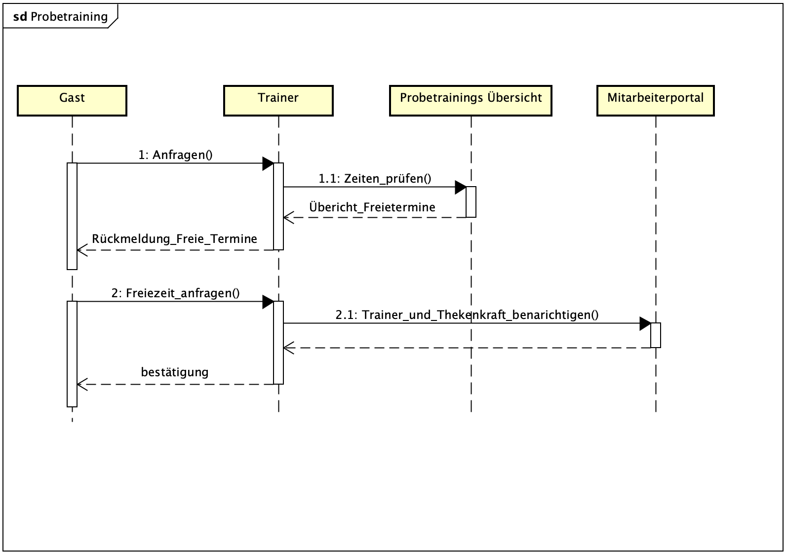
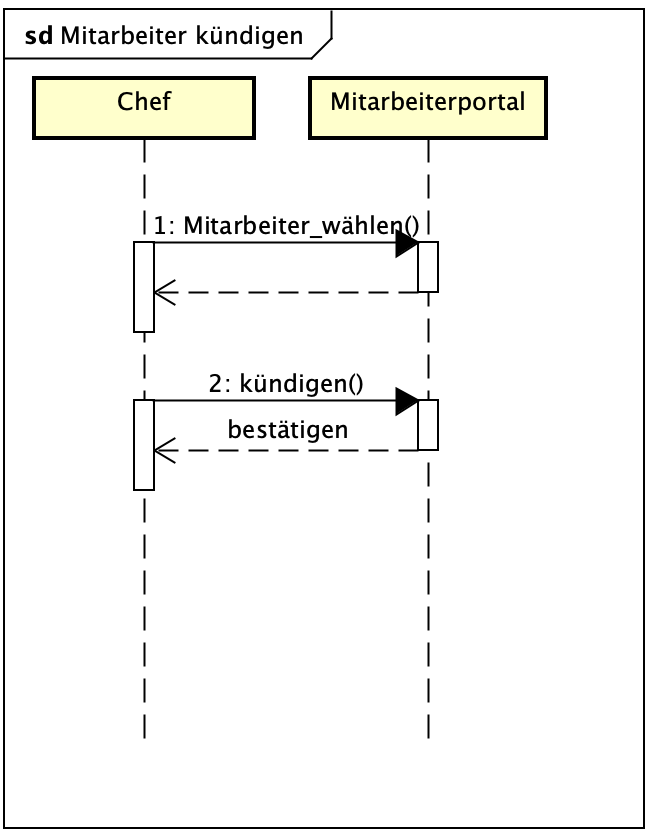
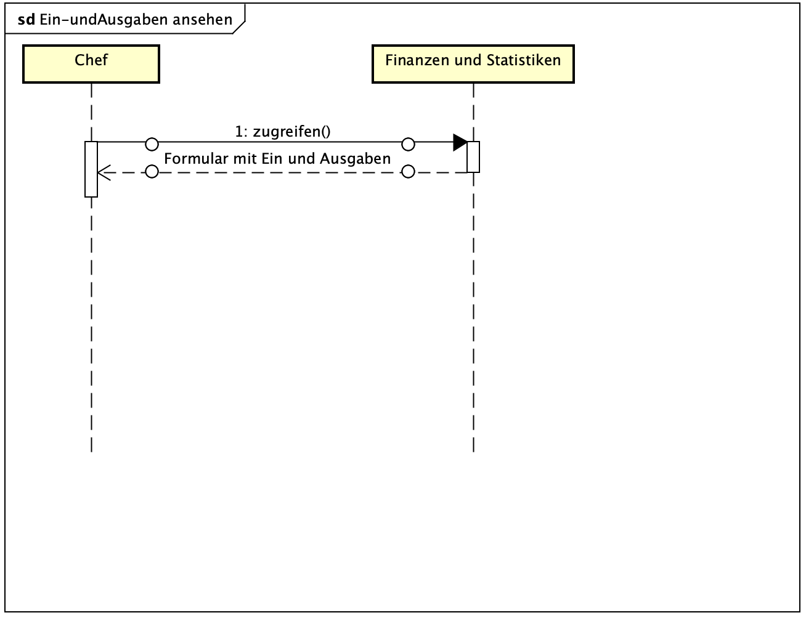
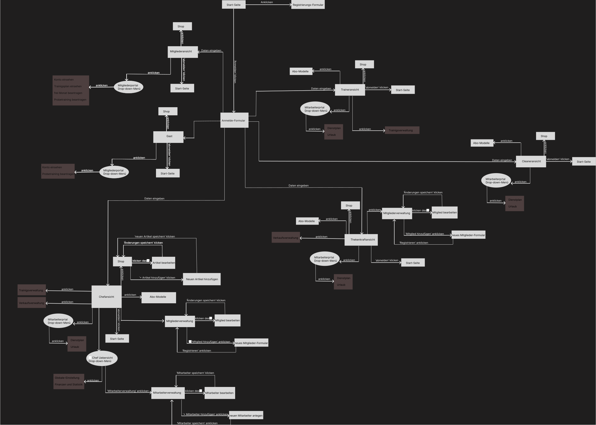
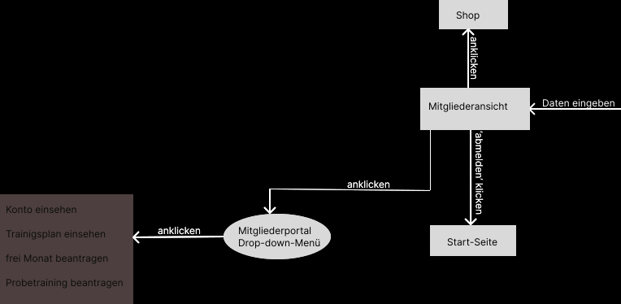
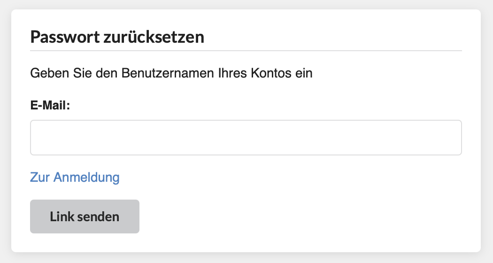
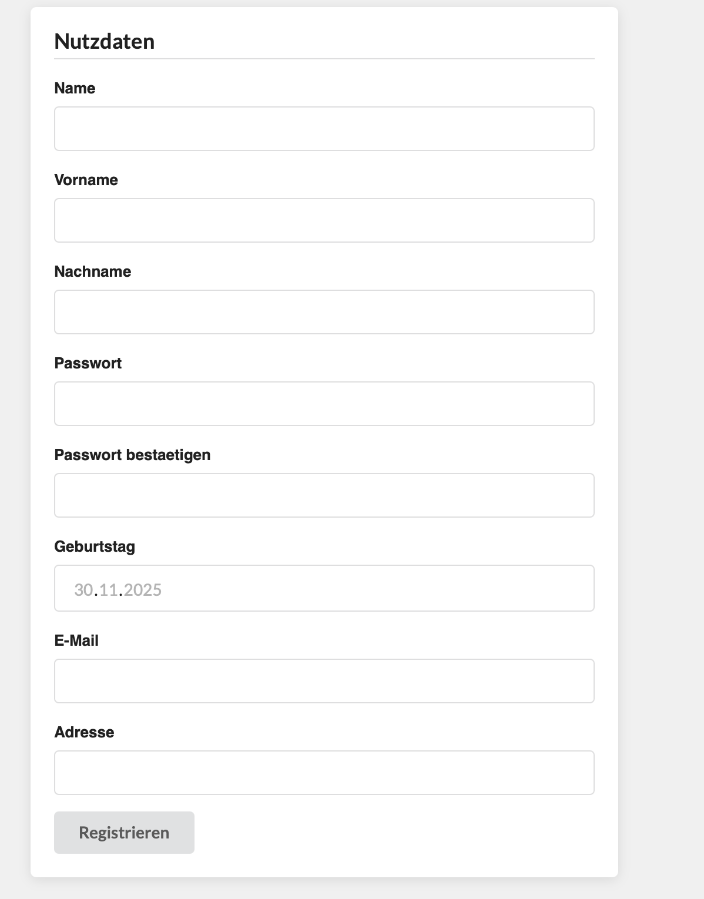
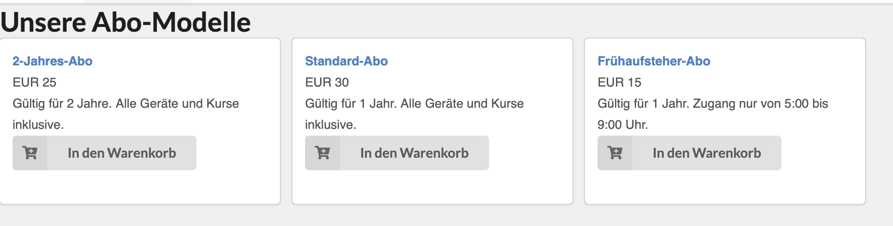
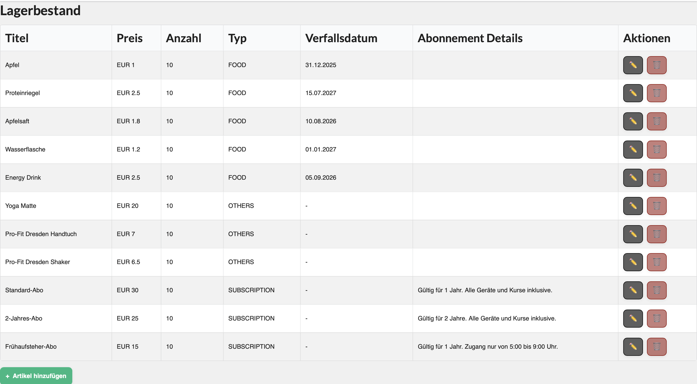
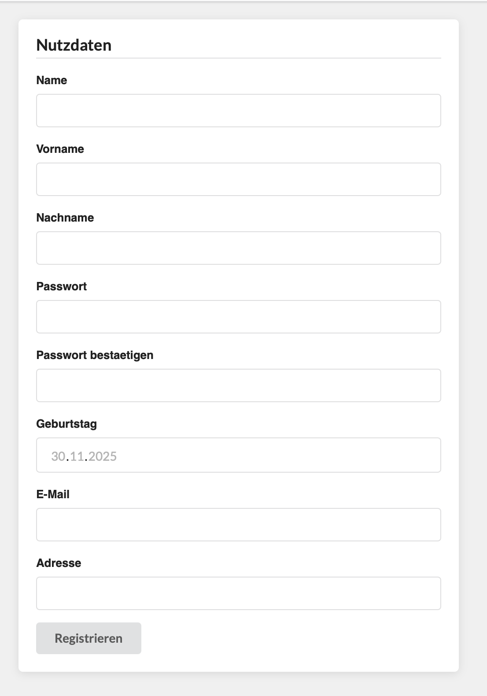

:project_name: ProFit Webseite
:imagesdir: images
:toc: left
:numbered:
= Pflichtenheft __{ProFit_Webseite}__

[options="header"]
[cols="1, 1, 1, 1, 4"]
|===
|Version | Status      | Bearbeitungsdatum   | Autoren(en) |  Vermerk
|0.1     | In Arbeit   | 10.10.2021          | Autor       | Initiale Version
|===

== Zusammenfassung
Dieses Dokument beschreibt die Software Requirement Specifications (SRS) für das Projekt ProFit-Webseite. Es zielt darauf ab eine Übersicht über das zu erstellende Software Produkt und seine Funktionen, als eine Basis für die Kommunikation zwischen den Stakeholders des Projekts, den Nutzern und des Entwicklerteams. Das Ziel hinter diesem Dokument ist es, das fundament für die Zusammenarbeit zwischen Auftraggeber und Auftragnehmer zu bilden. Die SRS beschreibt welche Anforderungen das fertige Produkt zu erfüllen hat und wie der Auftragnehmer diese Umsetzen wird.

Allgemein soll die SRS Korrekt, Vollständig, Beständig (correct, complete, consistent; ccc) sein. Da es am Ende dafür genutzt werden soll, diese Ziele zu Validieren, muss es nachvollziebar sein. Um wärend des Entwicklungsprozesses Änderungen vornehmen zu können, soll die SRS möglichst einfach zu bearbeiten und zu entwickeln sein. Nachdem die Stakeholders das fertige Produkt akzeptiert haben, sollten nachfolgende Änderungen minimiert werden. Aber weil der Auftraggeber seine Anforderungen anpassen könnte, muss im Vorhinein mit Umstellungen gerechnet werden, welche Dokumentiert werden sollen. 

== Aufgabenstellung und Zielsetzung
Aufgabenstellung:
Das Fitnessstudio ProFit ist ein mittelgroßes Fitnessstudio in dem Herzen von Dresden. Es erfreut sich großer Beliebtheit und hat eine große Anzahl an Mitgliedern. Nun soll die Verwaltung des Studios digitalisiert werden, damit die Mitarbeiter und Mitglieder sich auf das Wesentliche konzentrieren können. Dabei sollen verschiedene Geschäftsfelder berücksichtigt werden.

Der Inhaber des Fitnessstudios (_Chef_) besitzt einen speziellen Login und ist für die Verwaltung des Equipments, wie auch der Mitarbeiter Zuständig. Er erstellt die zugehörigen Accounts der Mitarbeiter (_hireEmployee_), teilt ihnen ihre Rechte zu und vergibt ein Einmal-Passwort (_EntryPasswort_).

In der Mitarbeiterverwaltung können die Mitarbeiter (_Employee_) des Fitnessstudios (_ProFit_) eingestellt (_hireEmployee_), bearbeitet (_editEmployee_)und entlassen (_fireEmployee_) werden. Die Mitarbeiter haben verschiedene Eigenschaften: Name (_Name_), Alter (_Age_), Gehalt (_Salary_), Überstunden (_OverTime_). Ein Dienstplan (_WorkSchedule_) muss ebenfalls erstellt werden, es muss zu jeder Zeit mind. eine Thekenkraft (_CounterStaff_) und ein Trainer (_Trainer_) anwesend sein. Am Abend muss eine Reinigungskraft (_Cleaner_) für 1h eingetragen sein. Die Mitarbeiter sollen einen eigenen Login (_Login_) bekommen, um den Dienstplan zu betrachten und Urlaubsanträge (_VacationRequest_)zu stellen.
Es sollen ebenfalls alle Mitglieder (_Member_) verwaltet werden können. Eigenschaften: Name (_Name_), Geburtstag (_Birthday_), E-mail (_EMail_), Adresse (_Adress_), Einstieg (_SignUp_), Passwort (_Password_), PayPalKonto (_PayPal_). Diese können in dem Studio aufgenommen (_admitMember_), bearbeitet (_editMember_) und gekündigt (_quitMember_) werden. Bei der Aufnahme soll ein Login (_Login_) erstellt werden, damit der Kunde von zu Hause aus seinen nächsten Trainingstermin (_TrainingDate_) samt Trainingsplan (_TrainingSchedule_) nachschlagen kann, Rechnungen (_Invoice_) betrachten kann und um persönliche Daten (_editData_) zu ändern . Für jedes Mitglied kann ein individueller Trainingsplan durch den Trainer erstellt werden.

Wirbt ein Mitglied ein neues Mitglied an, wird ihm ein bestimmter Betrag (_ReruitmentBonus_) auf sein Kundenkonto (_Account_) gutgeschrieben, welches er nur an der Theke (_Counter_) verbrauchen kann und nicht ausgezahlt wird.
Kunden (_Guest_), die zum ersten Mal das Studio besuchen, können mit einem Trainer ein Probetraining (_TrialTraining_) vereinbaren, entweder direkt im Studio oder über das Internetportal des Studios. Eine Mitgliedschaft kostet eine monatliche Gebühr (_Fee_) und kann pro Jahr für einen Monat ohne Gründe ausgesetzt werden. Am Ende des Monats wird für jeden Kunden eine Rechnung über sein Kundenkonto erstellt.

Des Weiteren gibt es einen Eingangs- und Verkaufsbereich (_Counter_). An der Theke können auch Getränke (_Drinks_), Nahrungsergänzungsmittel (_Supplements_) oder Zubehör (_Equipment_) erworben (_buy_) werden, diese werden bar bezahlt oder direkt vom Kundenkonto abgebucht. Die Artikel des Verkaufsbereiches müssen sich ebenfalls verwalten lassen. Es müssen Artikel (_Item_) hinzugefügt (_addItem_), bearbeitet (_editItem_) und gelöscht (_deleteItem_) werden können. Beim Unterschreiten der Mindestmenge (_MinimumQuantity_) müssen die Artikel für den Angestellten markiert (_flagItem_) werden, um nachbestellt (_reorderItem_) werden zu können. Artikel die für den Verzehr gedacht sind, haben ein Verfallsdatum (_ExpiryDate_), welches regelmäßig überprüft werden soll. Für verschiedene Artikel soll man feinen Rabatt (_Discount_) angeben können.
Ebenfalls sollen Statistiken (_Statistics_) über laufende Kosten (_Costs_), Einnahmen (_Profit_), Kundenverhalten (_MemberBehaviour_) und Verkaufsartikel (_SoldItems_) dargestellt werden. Verschiedene Einstellungen wie Vertragslaufzeit (_ContractRuntime_), monatliche Gebühren (_Fee_), Neuwerbungsprämie (_RecruitmentBonus_), Öffnungszeiten (_OpeningHours_), Rabatt usw. sollen sich einfach global, vom Chef, verändern lassen.

Zielsetzung:
Unser oberstes Ziel ist der termingerechte Abschluss des Projekts gemäß dem festgelegten Zeitplan. Als zentrales Ergebnis streben wir die Erstellung einer voll funktionalen Website an, die den Bedürfnissen der Nutzer optimal entspricht. Technisch legen wir großen Wert auf die Erstellung eines sauberen, verständlichen und gut strukturierten Codes, der leicht zu verwenden, zu modifizieren und zukünftig weiterzuentwickeln ist. Darüber hinaus ist uns ein übersichtliches und ansprechendes Design ein wichtiges Anliegen, um eine positive Nutzererfahrung zu gewährleisten. Schließlich wird der Gewährleistung der Datensicherheit höchste Priorität eingeräumt, um die Daten unserer Nutzer bestmöglich zu schützen.

== Produktnutzung
Das System wird über eine Schnittstelle genutzt, die als Webseite dargestellt und über das Internet mit gängigen Browsern wie Google Chrome und Firefox aufgerufen wird. Die Webseite ist 24/7 erreichbar.

Das System muss für folgende Browser zugänglich und visuell optimiert sein:
Google Chrome, Version 142.0.7390.52+
Firefox, Version 144.0.2+

Die Webseite ermöglicht es:

- Mitarbeitern des Fitnessstudios: Eingestellt, bearbeitet und entlassen zu werden, den Dienstplan einzusehen und Urlaubsanträge zu stellen.

- Mitgliedern: Im Studio aufgenommen, bearbeitet und gekündigt zu werden, Trainingstermine samt Trainingspläne nachzuschlagen, Rechnungen einzusehen und persönliche Daten zu ändern.

- Trainern: Personalisierte Trainingspläne für Mitglieder zu erstellen.

- Der Thekenkraft: Artikel hinzufügen, bearbeiten und löschen sowie die Preise der Produkte anpassen, um sie an Aktionsprogramme oder das Verfallsdatum der Produkte anzupassen.

Die Webseite verfügt über eine benutzerfreundliche und intuitive Benutzeroberfläche. Der Benutzer benötigt nicht unbedingt technisches Grundwissen.

== Interessensgruppen (Stakeholders)
Hier sind alle Gruppen oder Einzelpersonen (natürliche oder juristische Personen) aufgeführt, die Einfluss auf die Systemanforderungen haben.
In der folgenden Tabelle sind diese Stakeholder aufgelistet, ihnen wurde eine Priorität zugewiesen (dies erleichtert Entscheidungen, falls Anforderungen miteinander in Konflikt geraten)
und ihre übergeordneten Ziele werden beschrieben.

Die zugewiesenen Prioritäten reichen von 1 (niedrigste Priorität) bis 5 (höchste Priorität).

[options="header", cols="2, ^1, 4, 4"]
|===
| Name | Priorität (1..5) | Beschreibung | Ziele 
| Inhaber von ProFit | 5 | Der Auftraggeber und wichtigste Kunde dieses Projekts.| Digitalisieren der Administration des Fitnessstudios, Einfache Kundenverwaltung, Vorbeugung von fehlerhaftem Lagerbestand 
| Mitarbeiter | 4 | Die wichtigsten Nutzer dieser Webseite. Umfasst Trainer, Thekenkräfte und Putzkräfte | Einfach Verständliche/Übersichtliche und Bedienbare Webseite 
| Mitglieder | 4 | Die haupt Nutzer dieser Webseite, sollten zufrieden sein und Mitglied bleiben | Gute Nutzer-Erfahrung, Einfach bedienbare und übersichtliche Webseite 
| Gäste (Probetraining) | 3 | Zweitwichtigste Nutzergruppe, sollten Mitglieder werden | Allgemein ansprechende und informative Webseite 
| Entwickler | 3 | Personen, welche die Webseite Implementieren oder später für dessen Instandhaltung zuständig sind | Einfach Erweiterbare Webseite, Wenig Wartungs Aufwand, Gute debugging mechanismen 
| Administratoren | 2 | Nutzer, welche die Seite später verwalten sollen | Möglichkeit alle daten des Systems zu überblicken und zu bearbeiten 
|===

== Systemgrenze und Top-Level-Architektur

=== Kontextdiagramm
Das Kontextdiagramm zeigt das geplante Software-System in seiner Umgebung. Zur Umgebung gehören alle Nutzergruppen des Systems und Nachbarsysteme. Die Grafik kann auch informell gehalten sein. Überlegen Sie sich dann geeignete Symbole. Die Grafik kann beispielsweise mit Visio erstellt werden. Wenn nötig, erläutern Sie diese Grafik.

.Kontextdiagramm in UML
image::Component Diagram.svg[]

.Kontextdiagramm in C4 Notation
image::Kontext C4 Profit.png[]

=== Top-Level-Architektur

.Top Level Architektur in UML
image::FitnessPro Top Level Architecture.svg[]

.Top Level Architektur in C4 Notation
image::Component C4 ProFit.png[]

== Anwendungsfälle

=== Akteure

Akteure sind die Benutzer des Software-Systems oder Nachbarsysteme, welche darauf zugreifen. Dokumentieren Sie die Akteure in einer Tabelle. Diese Tabelle gibt einen Überblick über die Akteure und beschreibt sie kurz. Die Tabelle hat also mindestens zwei Spalten (Akteur Name und Kommentar).
Weitere relevante Spalten können bei Bedarf ergänzt werden.

// See http://asciidoctor.org/docs/user-manual/#tables
[options="header"]
[cols="1,4"]
|===
|Name |Beschreibung
|Benutzer  |Oberbegriff für alle Personen welche die Webseite nutzen, egal ob authentifiziert oder nicht.
|Registrierter (authentifizierter) Benutzer |Oberbegriff für alle Personen, welche einen account besitzen, eingeloggt sind und mit dem System interagieren.
|Unregestrierter Benutzer |Oberbegriff für alle Personen, welche noch keinen account besitzen ud nicht authentifiziert sind.
|Putzkraft  |Mitarbeiter (eigeteilt zur Reinigung)
|Trainer  |Mitarbeiter (eingeteilt für Geräte)
|Thekenkraft  |Mitarbeiter (eingeteilt für Verkauf an der Theke)
|Mitglied  |angemeldeter Kunde mit eingenem Kundenkonto
|Gast  |unangemeldeter/potentieller Kunde (für Buchung eines Probetrainings)
|Chef  |Führungsperson mit allen Rechten/ organisatorischen Fähigkeiten
|===

=== Überblick Anwendungsfalldiagramm
Anwendungsfall-Diagramm, das alle Anwendungsfälle und alle Akteure darstellt

image::Use-Cases-Diagramm.png[]

=== Anwendungsfallbeschreibungen
Dieser Unterabschnitt beschreibt die Anwendungsfälle. In dieser Beschreibung müssen noch nicht alle Sonderfälle und Varianten berücksichtigt werden. Schwerpunkt ist es, die wichtigsten Anwendungsfälle des Systems zu finden. Wichtig sind solche Anwendungsfälle, die für den Auftraggeber, den Nutzer den größten Nutzen bringen.
Für komplexere Anwendungsfälle ein UML-Sequenzdiagramm ergänzen.
Einfache Anwendungsfälle mit einem Absatz beschreiben.
Die typischen Anwendungsfälle (Anlegen, Ändern, Löschen) können zu einem einzigen zusammengefasst werden.

[cols="1h, 3"]
[[UC0010]]
|===
|ID                         |**<<UC0010>>**
|Name                       |Anmelden
|Beschreibung               |Ein registrierter Benutzer soll sich im System anmelden (authentifizieren) können, um auf weitere Funktionen zugreifen zu können. Dieser Vorgang kann durch Abmelden rückgängig gemacht werden.
|Akteure                    |Benutzer
|Auslöser                   |Der Benutzer möchte durch die Anmeldung auf „versteckte“ Funktionen zugreifen.
|Vorbedingung(en)           a|
|Essenzielle Schritte       a|
 1. Der Benutzer ruft den Menüpunkt „Einloggen“ in der Navigationsleiste auf.
 2. Der Benutzer gibt seine Zugangsdaten ein.
 3. Der Benutzer klickt auf die Schaltfläche „Anmelden“.
|Erweiterungen                |-
|Funktionale Anforderungen    |...
|===

[cols="1h, 3"]
[[UC0011]]
|===
|ID                         |**<<UC0011>>**
|Name                       |Abmelden
|Beschreibung               |Ein authentifizierter Benutzer soll sich aus dem System abmelden können
|Akteure                    |Registrierter Benutzer
|Auslöser                   |Der Benutzer möchte das System verlassen
|Vorbedingung(en)          a|Der Benutzer ist authentifiziert
|Essenzielle Schritte      a|
 1. Der Benutzer klickt in der Navigationsleiste auf „Abmelden“.
 2. Der Benutzer ist nicht mehr authentifiziert und sieht die Startseite.
|Erweiterungen              |-
|Funktionale Anforderungen  |...
|===

[cols="1h, 3"]
[[UC0020]]
|===
|ID                         |**<<UC0020>>**
|Name                       |Registrierung
|Beschreibung               |Ein unregistrierter Benutzer soll sich einen Account erstellen können
|Akteure                    |Unregistrierter Benutzer
|Auslöser                   |Ein Unregistrierter Benutzer möchte einen Account für sich erstellen indem er auf "Registrieren" drückt
|Vorbedingung(en)          a|Akteur ist nicht Angemeldet
|Essenzielle Schritte      a|
 1. Nicht authentifizierter Benutzer klickt auf „Registrieren“.
 2. Er gibt seine gewünschten Daten an.
 3. Das System prüft, ob der Benutzername bereits vergeben ist.
 4. Falls der Benutzername noch nicht vergeben ist: Ein Konto wird mit den angegebenen Daten erstellt.
 5. Andernfalls: Eine Fehlermeldung wird angezeigt.
|Erweiterungen                |-
|Funktionale Anforderungen    |...
|===

[cols="1h, 3"]
[[UC0100]]
|===
|ID                         |**<<UC0100>>**
|Name                       |Mitglieder Hinzufügen
|Beschreibung               |Ein neuer Mitglieder Account soll Angelegt werden können
|Akteure                    |Chef, Thekenkraft
|Auslöser                   |Ein neuer Mitglieder-Account soll angelegt werden
|Vorbedingung(en)          a|Mitglied-to-be ist nicht angemeldet
|Essenzielle Schritte      a|
 1. Chef oder Thekenkraft drückt auf "Mitglieder hinzufügen" in der Mitgliederverwaltung.
 2. Er gibt die gewünschten Daten an.
 3. Das System prüft, ob der Benutzername bereits vergeben ist.
 4. Falls der Benutzername noch nicht vergeben ist: Ein Konto wird mit den angegebenen Daten erstellt.
 5. Andernfalls: Eine Fehlermeldung wird angezeigt.
|Erweiterungen              |-
|Funktionale Anforderungen  |...
|===

image::Mitglied_hinzufuegen.png[]

- Sequenzdiagramm: Mitglieder Hinzufügen

[cols="1h, 3"]
[[UC0110]]
|===
|ID                         |**<<UC0110>>**
|Name                       |Mitglieder Kündigen
|Beschreibung               |Eins existierendes Mitglied soll entfernt werden können
|Akteure                    |Chef, Thekenkraft
|Auslöser                   |Ein existierendes Mitglied soll entfernt werden
|Vorbedingung(en)          a|Das zu entfernende Mitglied hat einen Account
|Essenzielle Schritte      a|
 1. Chef oder Thekenkraft drückt auf "Mitglied kündigen" in der Mitgliederverwaltung.
 2. Der Account des ausgewählten Mitglieds wird gelöscht.
|Erweiterungen                |-
|Funktionale Anforderungen    |...
|===

[cols="1h, 3"]
[[UC0120]]
|===
|ID                         |**<<UC0120>>**
|Name                       |Mitglieder Daten bearbeiten
|Beschreibung               |Die Account Daten eines Mitglieds sollen bearbeitet/geändert werden können
|Akteure                    |Chef, Thekenkraft
|Auslöser                   |Die Account Daten eines Mitglieds sollen bearbeitet/geändert werden
|Vorbedingung(en)          a|Das Mitglied besitzt einen Account
|Essenzielle Schritte      a|
 1. Chef oder Thekenkraft drückt auf "Mitglieder Daten bearbeiten" in der Mitgliederverwaltung.
 2. Er ersetzt die alten mit den neuen gewünschten Daten.
 3. Er drückt auf "Bestätigen".
|Erweiterungen              |-
|Funktionale Anforderungen  |...
|===

[cols="1h, 3"]
[[UC0130]]
|===
|ID                         |**<<UC0130>>**
|Name                       |Mitglieder Datenbank einsehen
|Beschreibung               |Chef oder Thekenkraft soll eine liste aller Mitarbeiter einsehen können
|Akteure                    |Chef, Thekenkraft
|Auslöser                   |Chef oder Thekenkraft möchte die Datenbank der Mitarbeiter einsehen
|Vorbedingung(en)          a|Chef oder Thekenkraft muss angemeldet sein
|Essenzielle Schritte      a|
 1. Chef oder Thekenkraft drückt auf "Mitglieder Datenbank" in der Mitgliederverwaltung.
 2. Eine Liste aller Mitarbeiter wird angezeigt.
|Erweiterungen                |-
|Funktionale Anforderungen    |...
|===

[cols="1h, 3"]
[[UC0200]]
|===
|ID                         |**<<UC0200>>**
|Name                       |Probetraining beantragen
|Beschreibung               |Ein Gast soll ein Probetraining beantragen können
|Akteure                    |Gast
|Auslöser                   |Ein Gast möchte ein Probetraining vereinbaren
|Vorbedingung(en)          a|-
|Essenzielle Schritte      a|
 1. Der Gast drückt auf "Probetraining beantragen" im Mitgliederportal.
 2. Das System prüft in der Probetrainings-Übersicht auf freie Termine.
 3. Der Gast wählt eine freie Zeit aus.
 4. Thekenkraft und Trainer werden darüber informiert.
|Erweiterungen              |-
|Funktionale Anforderungen  |...
|===

- Sequenzdiagramm: Probetraining Beantragen

[cols="1h, 3"]
[[UC0210]]
|===
|ID                         |**<<UC0210>>**
|Name                       |Trainingsplan einsehen
|Beschreibung               |Ein Mitglied soll seinen Trainingsplan einsehen können
|Akteure                    |Mitglied
|Auslöser                   |Ein Mitglied möchte seinen Trainsplan einsehen
|Vorbedingung(en)          a|Das Mitglied ist angemeldet
|Essentielle Schritte      a|
 1. Das Mitglied drückt auf "Trainingsplan einsehen" im Mitgliederportal.
 2. Sein Trainingsplan wird angezeigt.
|Erweizerungen              |-
|Funktionale Anforderungen  |...
|===

[cols="1h, 3"]
[[UC0220]]
|===
|ID                         |**<<UC0220>>**
|Name                       |Konto einsehen
|Beschreibung               |Ein Mitglied soll sein Konto einsehen können
|Akteure                    |Mitglied
|Auslöser                   |Ein Mitglied möchte sein Konto einsehen
|Vorbedingung(en)          a|Das Mitglied ist angemeldet
|Essenzielle Schritte      a|
 1. Das Mitglied drückt auf "Konto einsehen" im Mitgliederportal.
 2. Seine Konto Daten werden angezeigt.
|Erweiterungen              |-
|Funktionale Anforderungen  |...
|===

[cols="1h, 3"]
[[UC0221]]
|===
|ID                         |**<<UC0221>>**
|Name                       |Guthaben einzahlen
|Beschreibung               |Ein Mitglied soll Geld auf sein Konto aufladen können
|Akteure                    |Mitglied
|Auslöser                   |Ein Mitglied möchte Guthaben auf sein Konto laden
|Vorbedingung(en)          a|Das Mitglied ist angemeldet
|Essenzielle Schritte      a|
 1. Das Mitglied drückt auf "Guthaben einzahlen" in der Kontoansicht im Mitgliederportal.
 2. Das Mitglied wird zur Zahlungsdienstleistung weitergeleitet.
 3. Der gewählte Betrag wird auf das Konto geladen.
|Erweiterungen              |- Das Mitglied muss vorher auf "Konto einsehen" gegangen sein.
|Funktionale Anforderungen  |...
|===

image::Guthaben_aufladen.png[]

- Sequenzdiagramm: Guthaben einzahlen

[cols="1h, 3"]
[[UC0230]]
|===
|ID                         |**<<UC0230>>**
|Name                       |frei-Monat beantragen
|Beschreibung               |Ein Mitglied soll seinen frei-Monat beantragen können
|Akteure                    |Mitglied
|Auslöser                   |Ein Mitglied möchte seinen frei-Monat einlösen
|Vorbedingung(en)          a|Das Mitglied ist angemeldet
|Essenzielle Schritte      a|
 1. Das Mitglied drückt auf "frei-Monat beantragen" im Mitgliederportal.
 2. Das Mitglied wählt einen Monat aus.
 3. Das System prüft ob im gerade laufenden Jahr noch kein frei-Monat gewählt woder ist.
 4. Falls nicht: - Der gewählte Monat wird als frei-Monat registriert.
                 - Die Mitgliedschaft wird für den gewählten Monat ausgesetzt.
 5. Falls ja: Eine Meldung mit "Sie haben bereits ihren frei-Monat in diesem Jahr eingelöst."
|Erweiterungen              |-
|Funktionale Anforderungen  |...
|===

[cols="1h, 3"]
[[UC0300]]
|===
|ID                         |**<<UC0300>>**
|Name                       |Trainingsplan erstellen
|Beschreibung               |Chef oder Trainer soll einen Trainingsplan für ein Mitglied erstellen können
|Akteure                    |Chef, Trainer
|Auslöser                   |Chef oder Trainer möchte einen Trainingsplan für ein Mitglied erstellen
|Vorbedingung(en)          a|Das Mitglied muss einen account haben; Chef oder Trainer muss angemeldet sein
|Essenzielle Schritte      a|
 1. Ein Trainer wählt ein Mitglied aus (er drückt darauf) in der Trainingsverwaltung.
 2. Er drückt aud "Trainingsplan erstellen".
 3. Er gibt die gewünschten Zeiten und Übungen aus.
 4. Er drückt auf "Bestätigen".
|Erweiterungen                |-
|Funktionale Anforderungen    |...
|===

image::Trainigsplan_erstellen.png[]

- Sequenzdiagramm: Trainingsplan erstellen

[cols="1h, 3"]
[[UC0310]]
|===
|ID                         |**<<UC0310>>**
|Name                       |Trainingszeiten ändern 
|Beschreibung               |Die Trainingszeiten eines Mitglieds sollen geändert werden können
|Akteure                    |Chef, Trainer
|Auslöser                   |Chef oder Trainer möchte die Trainingszeiten eines Mitglieds ändern/bearbeiten
|Vorbedingung(en)          a|Es muss ein Trainingsplan für das gewählte Mitglied existieren; Chef oder Trainer muss angemeldet sein.
|Essenzielle Schritte      a|
 1. Chef oder Trainer wählt ein Mitglied aus (er drückt darauf) in der Trainingsverwaltung.
 2. Er drückt auf "Trainingszeiten ändern".
 3. Er ersetzt die alten mit den neuen gewünschten Trainingszeiten.
 4. Er drückt auf "Bestätigen".
|Erweiterungen                |-
|Funktionale Anforderungen    |...
|===

image::Trainigszeiten_aendern.png[]

- Sequenzdiagramm: Trainingszeiten ändern

[cols="1h, 3"]
[[UC0320]]
|===
|ID                         |**<<UC0320>>**
|Name                       |Trainingsübungen ändern 
|Beschreibung               |Die Trainingsübungen eines Mitglieds sollen geändert werden können
|Akteure                    |Chef, Trainer
|Auslöser                   |Chef oder Trainer möchte die Trainingsübungen eines Mitglieds ändern/bearbeiten
|Vorbedingung(en)          a|Es muss ein Trainingsplan für das gewählte Mitglied existieren; Chef oder Trainer muss angemeldet sein
|Essenzielle Schritte      a|
 1. Chef oder Trainer wählt ein Mitglied aus (er drückt darauf) in der Trainingsverwaltung.
 2. Er drückt auf "Trainingsübungen ändern".
 3. Er ersetzt die alten mit den neuen gewünschten Trainingsübungen.
 4. Er drückt auf "Bestätigen".
|Erweiterungen                |-
|Funktionale Anforderungen    |...
|===

image::Trainigsuebung_aendern.png[]

- Sequenzdiagramm: Trainingsübungen ändern

[cols="1h, 3"]
[[UC0330]]
|===
|ID                         |**<<UC0330>>**
|Name                       |Probetrainings-Übersicht einsehen
|Beschreibung               |Chef oder Trainer sollen eine Probetrainings-Übersicht einsehen können
|Akteure                    |Chef, Trainer
|Auslöser                   |Chef oder Trainer möchte die Probetrainings-Übersicht einsehen
|Vorbedingung(en)          a|Chef oder Trainer muss angemeldet sein
|Essenzielle Schritte      a|
 1. Chef oder Trainer drückt auf "Probetrainings-Übersicht" in der Trainingsverwaltung.
 2. Eine Übersicht der gebuchten Probetrainings wird angezeigt.
|Erweiterungen                |-
|Funktionale Anforderungen    |...
|===

[cols="1h, 3"]
[[UC0400]]
|===
|ID                         |**<<UC0400>>**
|Name                       |Bestand ansehen
|Beschreibung               |Der Bestand des Verkaufsbereiches soll angesehen werden können
|Akteure                    |Chef, Thekenkraft
|Auslöser                   |Chef oder Thekenkraft möchten den Bestand des Verkaufsbereiches ansehen
|Vorbedingung(en)          a|Chef oder Thekenkraft muss angemeldet sein
|Essenzielle Schritte      a|
 1. Chef oder Thekenkraft drückt auf "Bestand ansehen" im Bereich der Verkaufsverwaltung.
 2. Eine Bestandsliste wird angezeigt.
|Erweiterungen                |-
|Funktionale Anforderungen    |...
|===

[cols="1h, 3"]
[[UC0410]]
|===
|ID                         |**<<UC0410>>**
|Name                       |Nachbestellen
|Beschreibung               |Sobald die Anzahl eines Artikels zu niedrig wird und es dem Chef und der Thekenkraft gemeldet wird, soll sie diesen Artikel nachbestellen können
|Akteure                    |Chef, Thekenkraft
|Auslöser                   |Chef oder Thekenkraft möchte einen Artikel nachbestellen
|Vorbedingung(en)          a|Chef oder Thekenkraft muss angemeldet sein
|Essenzielle Schritte      a|
 1. Chef oder Thekenkraft wählt einen Artikel in der Bestandsliste aus.
 2. Er drückt auf "Nachbestellen".
 3. Das System leitet ihn zu der zugehörigen Webseite weiter.
|Erweiterungen                |-
|Funktionale Anforderungen    |...
|===

image::Nachbestellungen.png[]

- Sequenzdiagramm:  Nachbestellen

[cols="1h, 3"]
[[UC0500]]
|===
|ID                         |**<<UC0500>>**
|Name                       |Dienstsplan einsehen
|Beschreibung               |Trainer, Thekenkraft oder Putzkraft soll den Dienstplan der Woche einsehen können
|Akteure                    |Trainer, Thekenkraft, Putzkraft
|Auslöser                   |Trainer, Thekenkraft oder Putzkraft möchter seinen Dienstplan der Woche einsehen
|Vorbedingung(en)          a|Trainer, Thekenkraft oder Putzkraft muss angemeldet sein
|Essenzielle Schritte      a|
 1. Trainer, Thekenkraft oder Putzkraft drückt auf "Dienstplan einsehen" im Mitarbeiterportal.
 2. Der Dienstplan der gewählten Woche wird angezeigt.
|Erweiterungen                |-
|Funktionale Anforderungen    |...
|===

[cols="1h, 3"]
[[UC0510]]
|===
|ID                         |**<<UC0510>>**
|Name                       |Urlaub beantragen
|Beschreibung               |Trainer, Thekenkraft oder Putzkraft soll Urlaub beantragen können
|Akteure                    |Trainer, Thekenkraft oder Putzkraft
|Auslöser                   |Trainer, Thekenkraft oder Putzkraft möchte Urlaub beantragen
|Vorbedingung(en)          a|Trainer, Thekenkraft oder Putzkraft muss angemeldet sein
|Essenzielle Schritte      a|
 1. Trainer, Thekenkraft oder Putzkraft drückt auf "Urlaub beantragen" im Mitarbeiterportal.
 2. Er gibt den gewünschten Zeitraum an.
 3. Er drückt auf "Bestätigen".
 4. Der Chef wird über den Antrag informiert und kann diesen annehmen oder ablehnen.
|Erweiterungen                |-
|Funktionale Anforderungen    |...
|===

image::Urlaub_beantragen.png[]

- Sequenzdiagramm: Urlaub beantragen

[cols="1h, 3"]
[[UC0600]]
|===
|ID                         |**<<UC0600>>**
|Name                       |Mitarbeiter einstellen
|Beschreibung               |Der Chef soll einen neuen Account für einen neuen Mitarbeiter erstellen können
|Akteure                    |Chef
|Auslöser                   |Der Chef möchte einen neuen Mitarbeiteraccount erstellen
|Vorbedingung(en)          a|Der Chef muss angemeldet sein
|Essenzielle Schritte      a|
 1. Chef drückt auf "Mitarbeiter einstellen" in der Mitarbeiterverwaltung.
 2. Er gibt die gewünschten Daten an.
 3. Das System prüft, ob der Benutzername bereits vergeben ist.
 4. Falls der Benutzername noch nicht vergeben ist: Ein Konto wird mit den angegebenen Daten erstellt.
 5. Andernfalls: Eine Fehlermeldung wird angezeigt.
|Erweiterungen                |-
|Funktionale Anforderungen    |...
|===

[cols="1h, 3"]
[[UC0610]]
|===
|ID                         |**<<UC0610>>**
|Name                       |Mitarbeiter kündigen
|Beschreibung               |Der Chef soll den Account eines Mitarbeiters löschen können
|Akteure                    |Chef
|Auslöser                   |Der Chef möchte einen Mitarbeiteraccount löschen
|Vorbedingung(en)          a|Der Chef muss angemeldet sein
|Essenzielle Schritte      a|
 1. Chef drückt auf "Mitarbeiter kündigen" im Fenster eines Mitarbeiters in der Mitarbeiterverwaltung.
 2. Der gewählte Mitarbeiteaccount wird gelöscht.
|Erweiterungen                |-
|Funktionale Anforderungen    |...
|===

- Sequenzdiagramm: Mitarbeiter kündigen

[cols="1h, 3"]
[[UC0620]]
|===
|ID                         |**<<UC0620>>**
|Name                       |Mitarbeiter bearbeiten
|Beschreibung               |Der Chef soll den Account eines Mitarbeiters bearbeiten können
|Akteure                    |Chef
|Auslöser                   |Der Chef möchte einen Mitarbeiteraccount bearbeiten
|Vorbedingung(en)          a|Der Chef muss angemeldet sein
|Essenzielle Schritte      a|
 1. Chef drückt auf "Mitarbeiter bearbeiten" im Fenster eines Mitarbeiters in der Mitarbeiterverwaltung.
 2. Er ersetzt die alten mit den neuen gewünschten Daten.
 3. Er drückt auf "Bestätigen".
|Erweiterungen                |-
|Funktionale Anforderungen    |...
|===

[cols="1h, 3"]
[[UC0630]]
|===
|ID                         |**<<UC0630>>**
|Name                       |Mitarbeiter Datenbank einsehen
|Beschreibung               |Der Chef soll eine liste aller Mitarbeiter einsehen können
|Akteure                    |Chef
|Auslöser                   |Der Chef möchte die Datenbank der Mitarbeiter einsehen
|Vorbedingung(en)          a|Der Chef muss angemeldet sein
|Essenzielle Schritte      a|
 1. Der Chef drückt auf "Mitarbeiter Datenbank" in der Mitarbeiterverwaltung.
 2. Eine Liste aller Mitarbeiter wird angezeigt.
|Erweiterungen                |-
|Funktionale Anforderungen    |...
|===

[cols="1h, 3"]
[[UC0640]]
|===
|ID                         |**<<UC0640>>**
|Name                       |Urlaubs Übersicht einsehen
|Beschreibung               |Der Chef soll eine Übersicht aller Urlaube einsehen können
|Akteure                    |Chef
|Auslöser                   |Der Chef möchte die Urlaubs Übersicht einsehen
|Vorbedingung(en)          a|Der Chef muss angemeldet sein
|Essenzielle Schritte      a|
 1. Der Chef drückt auf "Urlaubs Übersicht" in der Mitarbeiterverwaltung.
 2. Eine Übersicht der kommenden Urlaube wird angezeigt.
|Erweiterungen                |-
|Funktionale Anforderungen    |...
|===

[cols="1h, 3"]
[[UC0640]]
|===
|ID                         |**<<UC0650>>**
|Name                       |Dienstplan ändern
|Beschreibung               |Der Chef soll den Dienstplan ändern können
|Akteure                    |Chef
|Auslöser                   |Der Chef möchte den Dienstplan ändern
|Vorbedingung(en)          a|Der Chef muss angemeldet sein
|Essenzielle Schritte      a|
 1. Der Chef drückt auf "Diesntplan ändern" in der Mitarbeiterverwaltung.
 2. Er ersetzt den alten mit dem neuen Dienstplan.
 3. Er drückt auf "Bestätigen".
|Erweiterungen                |-
|Funktionale Anforderungen    |...
|===

[cols="1h, 3"]
[[UC0700]]
|===
|ID                         |**<<UC0700>>**
|Name                       |Ein- und Ausgaben einsehen
|Beschreibung               |Der Chef soll die Statistiken der Ein- und Ausgaben einsehen können
|Akteure                    |Chef
|Auslöser                   |Der Chef möchte die Statistiken der Ein- und Ausgaben einsehen
|Vorbedingung(en)          a|Der Chef muss angemeldet sein
|Essenzielle Schritte      a|
 1. Der Chef drückt auf "Ein- und Ausgaben einsehen" im Abschnitt "Finanzen und Statistik".
 2. Die Diagramme über die Ein- und Ausgaben werden angezeigt.
|Erweiterungen                |-
|Funktionale Anforderungen    |...
|===

- Sequenzdiagramm: Ein- und Ausgaben einsehen

[cols="1h, 3"]
[[UC0710]]
|===
|ID                         |**<<UC0710>>**
|Name                       |Gewinn- und Verlustrechnung (GuV)
|Beschreibung               |Der Chef soll die Übersicht zur GuV einsehen können
|Akteure                    |Chef
|Auslöser                   |Der Chef möchte die GuV Übersicht einsehen
|Vorbedingung(en)          a|Der Chef muss angemeldet sein
|Essenzielle Schritte      a|
 1. Der Chef drückt auf "GuV" im Abschnitt "Finanzen und Statistik".
 2. Die GuV Übersicht wird angezeigt.
|Erweiterungen                |-
|Funktionale Anforderungen    |...
|===

[cols="1h, 3"]
[[UC0800]]
|===
|ID                         |**<<UC0800>>**
|Name                       |Rabatt ändern
|Beschreibung               |Der Chef soll global die höhe des Rabatts anpassen können
|Akteure                    |Chef
|Auslöser                   |Der Chef möchte den Rabatt anpassen
|Vorbedingung(en)          a|Der Chef muss angemeldet sein
|Essenzielle Schritte      a|
 1. Der Chef drückt auf "Rabatt ändern" im Abschnitt der Globalen EInstellungen.
 2. Er ersetzt den alten mit dem neuen gewünschten Betrag.
 3. Er drückt auf "Bestätigen".
|Erweiterungen                |-
|Funktionale Anforderungen    |...
|===

[cols="1h, 3"]
[[UC0810]]
|===
|ID                         |**<<UC0810>>**
|Name                       |Öffnungszeiten ändern
|Beschreibung               |Der Chef soll global die Öffnungszeiten anpassen können
|Akteure                    |Chef
|Auslöser                   |Der Chef möchte die Öffnungszeiten anpassen
|Vorbedingung(en)          a|Der Chef muss angemeldet sein
|Essenzielle Schritte      a|
 1. Der Chef drückt auf "Rabatt ändern" im Abschnitt der Globalen EInstellungen.
 2. Er ersetzt den alten mit dem neuen gewünschten Betrag.
 3. Er drückt auf "Bestätigen".
|Erweiterungen                |-
|Funktionale Anforderungen    |...
|===

[cols="1h, 3"]
[[UC0820]]
|===
|ID                         |**<<UC0820>>**
|Name                       |Neuwerbungsprämie ändern
|Beschreibung               |Der Chef soll global die Neuwerbungsprämie anpassen können
|Akteure                    |Chef
|Auslöser                   |Der Chef möchte die Neuwerbungsprämie anpassen
|Vorbedingung(en)          a|Der Chef muss angemeldet sein
|Essenzielle Schritte      a|
 1. Der Chef drückt auf "Rabatt ändern" im Abschnitt der Globalen EInstellungen.
 2. Er ersetzt den alten mit dem neuen gewünschten Betrag.
 3. Er drückt auf "Bestätigen".
|Erweiterungen                |-
|Funktionale Anforderungen    |...
|===

[cols="1h, 3"]
[[UC0830]]
|===
|ID                         |**<<UC0830>>**
|Name                       |Monatliche Gebühren ändern
|Beschreibung               |Der Chef soll global die Monatlichen Gebühren anpassen können
|Akteure                    |Chef
|Auslöser                   |Der Chef möchte die Monatlichen Gebühren anpassen
|Vorbedingung(en)          a|Der Chef muss angemeldet sein
|Essenzielle Schritte      a|
 1. Der Chef drückt auf "Rabatt ändern" im Abschnitt der Globalen EInstellungen.
 2. Er ersetzt den alten mit dem neuen gewünschten Betrag.
 3. Er drückt auf "Bestätigen".
|Erweiterungen                |-
|Funktionale Anforderungen    |...
|===

[cols="1h, 3"]
[[UC0840]]
|===
|ID                         |**<<UC0840>>**
|Name                       |Vertragslaufzeit ändern
|Beschreibung               |Der Chef soll global die Vertragslaufzeit anpassen können
|Akteure                    |Chef
|Auslöser                   |Der Chef möchte die Vertragslaufzeit anpassen
|Vorbedingung(en)          a|Der Chef muss angemeldet sein
|Essenzielle Schritte      a|
 1. Der Chef drückt auf "Rabatt ändern" im Abschnitt der Globalen EInstellungen.
 2. Er ersetzt den alten mit dem neuen gewünschten Betrag.
 3. Er drückt auf "Bestätigen".
|Erweiterungen                |-
|Funktionale Anforderungen    |...
|===

== Funktionale Anforderungen

=== Muss-Kriterien
Was das zu erstellende Programm auf alle Fälle leisten muss.

[options="header", cols="1, 1, 2, 8"]
|===
|ID|Version|Name|Beschreibung

|F0xx
|-
|-
|Auf Funktionen der Form F0xx können alle zugreifen, Kunden, Mitarbeiter und der Chef

|F001
|v0.1
|Registrierung
a|Erlaubt es einem Benutzer ein Konto anzulegen. 
  Zu dieser Seite gelangt man über einen Button in der Menüleiste. 
  Um sich zu registrieren muss er folgende Informationen angeben:

* E-Mail Adresse
* Name
* Passwort
* Passwort bestätigen
* (Optional) Anwerber

|F002
|v0.1
|Anmeldung
a|Zu dieser Seite gelangt man über einen Button auf der Menüleiste. Hier können sich Nutzer anmelden. Falls man noch kein Kunde ist gibt es hier auch einen Button der zur Registrieren Seite(F001) führt. Dafür müssen sie folgende Daten bereitstellen:

* E-Mail Adresse
* Passwort

|F003
|v0.1
|Probetraining vereinbaren
a|Auf dieser Seite können Nutzer ein Probetraining beantragen. Dafür benötigt man kein Kundenkonto. Zudem können die Mitarbeiter auch hier ein Probetrining für einen Kunden im Studio vereinbaren. Um ein Probetraining zu buchen werden folgende Informationen benötigt:

* Name
* E-Mail Adresse
* Datum und Zeitwunsch

|F004
|v0.1
|Mitgliederportal
a|Registrierte Mitglieder sehen hier: 

* ihren Trainingsplan
* ihre Rechnungen  

Zudem können sie hier ihre Persönlichen Daten bearbeiten. Falls ein nicht angemeldetes Mitglied versucht auf diese seite zu gelandgen wird es auf die Login Seite(F002) geschickt.

|F005
|v0.1
|Kundenkonto
a|Hier werden Daten gespeichert/verwaltet wie:

* Gutschrift für neu angeworbene Kunden
* Sammlung der monatlichen Gebühr + Betrag der Einkäufe
* Betrag der Abbuchung am Ende des Monats

|F1xx
|-
|-
|Auf alle Funktionen der Form F1xx dürfen nur Mitarbeiter und Chef zugreifen

|F101
|v0.1
|Mitarbeiterportal
a|Hier können die Mitarbeiter ihren Dienstplan einsehen und Urlaubsanträge stellen. Um auf diese Seite zu gelangen müssen sich die Mitarbeiter erst identifizieren in F002. Hierfür brauchen sie:

* Mitarbeiter-ID
* Passwort

|F102
|v0.1
|Trainingsverwaltung
a|Hier kann ein Trainer einen Trainingsplan erstllen und bereits vorhandene bearbeiten.

|F103
|v0.1
|Mitgliederverwaltung
a|Hierauf können Mitarbeiter nach ihrem Login zugreifen. Dort können sie:

* Mitglieder aufnehmen
* Mitglieder bearbeiten
* Mitglieder kündigen

|F104
|v0.1
|Verkaufsverwaltung
a|Erlaubt es den Mitarbeitern Artikel zu verwalten. Das bedeutet konkret, sie können hier:

* Artikel hinzufügen (mit Mindestmenge, mit Haltbarkeitsdatum falls vorhanden)
* Artikel bearbeiten
* Artikel löschen
* Rabatt festlegen
* Artikel verkaufen(sowohl Bar als auch mit Guthaben auf dem Kundenkonto)

Zudem wird hier eine Warnung ausgegeben wenn die Mindestmenge eines Artikels unterschritten wird.

|F2xx
|-
|-
|Auf alle Funktionen der Form F2xx darf nur der Chef zugreifen!

|F201
|v0.1
|Mitarbeiterverwaltung
a|Zu diesem Bereich hat nur der Chef Zugriff. Hier kann er:

* Mitarbeiter einstellen und ihre Rolle bearbeiten(Reinigungskraft oder Trainer/Thekenkraft)
* Mitarbeiter bearbeiten 
* Mitarbeiter entlassen

|F202
|v0.1
|Dienstplan 
a|Hier kann der Chef den Dienstplan erstellen bzw bearbeiten. Auf diese Seite kommt man nur über einen Button der nur erscheint, wenn man als Chef eingeloggt ist. Die folgenden Kriterien sind beim erstellen zu beachten:

* Immer mindestens 1 Trainer und 1 Thekenkraft zur gleichen Zeit
* Zuordnung der Mitarbeiter, welche Rolle er an diesem Tag hat
* Putzkraft für 1h nach Schließung des Studios

|F203
|v0.1
|Statistiken
a|Auf dieser Seite hat der Chef eine Übersicht auf die wichtigsten Statistiken. Dies beinhaltet: 

* Die laufenden Kosten 
* Einnahmen 
* Das Kundenverhalten
* Die Verkaufsartikel(Bestand, Preis)

|F204
|v0.1
|Einstellungen
|Hier bearbeitet der Chef die Vertragslaufzeit, die monatlichen Gebühren für die Mitgliedschaft, die Höhe der Neuwerbungsprämie und er kann die Öffnungszeiten ändern.

|===

=== Kann-Kriterien
Anforderungen die das Programm leisten können soll, aber für den korrekten Betrieb entbehrlich sind.

[options="header", cols="1, 1, 2, 8"]
|===
|ID|Version|Name|Beschreibung

|E001
|v0.1
|Pause der Mitgliedschaft
a|Hier können Kunden eine Pause ihrer Mitgliedschaft beantragen(1 Monat). In dieser Pause wird kein monatlicher Betrag fällig. Dadurch verschiebt sich allerdings auch die Vertragslaufzeit um 1 Monat. Der Vertrag läuft dann beispielsweise nicht mehr bis Januar 2026, sondern aufgrund der Pause bis Februar 2026.

|E101
|v0.1
|Extra Rabatte
a|Kunden können extra Rabatte haben, z.B. zu ihrem Geburtstag oder ein Premium Kunde.

|E102
|v0.1
|Einzelne Rabatte
a|Hier können Mitarbeiter einzelnen Artikeln einen Rabatt geben.

|E201
|v0.1
|Stoßzeiten
a|Hier kann der Chef Stoßzeiten einstellen. Zu diesen Zeiten sollen mehr Mitarbeiter im Dienstplan eingeteilt werden.

|===

== Nicht-Funktionale Anforderungen

=== Qualitätsziele

Dokumentieren Sie in einer Tabelle die Qualitätsziele, welche das System erreichen soll, sowie deren Priorität.

=== Konkrete Nicht-Funktionale Anforderungen

Beschreiben Sie Nicht-Funktionale Anforderungen, welche dazu dienen, die zuvor definierten Qualitätsziele zu erreichen.
Achten Sie darauf, dass deren Erfüllung (mindestens theoretisch) messbar sein muss.

== GUI Prototyp

In diesem Kapitel soll ein Entwurf der Navigationsmöglichkeiten und Dialoge des Systems erstellt werden.
Idealerweise entsteht auch ein grafischer Prototyp, welcher dem Kunden zeigt, wie sein System visuell umgesetzt werden soll.
Konkrete Absprachen - beispielsweise ob der grafische Prototyp oder die Dialoglandkarte höhere Priorität hat - sind mit dem Kunden zu treffen.

=== Überblick: Dialoglandkarte
Erstellen Sie ein Übersichtsdiagramm, das das Zusammenspiel Ihrer Masken zur Laufzeit darstellt. Also mit welchen Aktionen zwischen den Masken navigiert wird.
//Die nachfolgende Abbildung zeigt eine an die Pinnwand gezeichnete Dialoglandkarte. Ihre Karte sollte zusätzlich die Buttons/Funktionen darstellen, mit deren Hilfe Sie zwischen den Masken navigieren.

- Dialogkarte Gesamte Karte. Die dukel unterlegten sind noch nicht fertig implementiert

image::Chef Dialogkarte.svg[]

- Dialogkarten: Ausschitt des Chefs

- Dialogkarten: Ausschitt der Mitglieder

image::Trainer Dialogkarte.svg[]

- Dialogkarten: Ausschitt der Trainer

image::Thekenkraft Dialogkarte.svg[]

- Dialogkarten: Ausschitt der Thekenkraft

image::Cleaner Dialogkarte.svg[]

- Dialogkarten: Ausschitt des Cleaners

image::Gast Dialogkarte.svg[]

- Dialogkarten: Ausschitt des Gast

=== Dialogbeschreibung
Für jeden Dialog:

image::Start-Seite.png[]

- Start Seite wenn man ohne anmeldung auf die Webseite kommt

image::Anmeldung.png[]

- Das Anmelde-Formular

- Wenn der Nutzer sein Passwort vergessen hat kan er sich eine E-Mail senden lassen und es ändern.

- Das Registrier-Formular. Für neue Leute

image::Gast Start-Seite.png[]

- Erste Seite die angezeigt, wenn sich ein Gast anmeldet

- Erste Seite die angezeigt, wenn sich ein Mitglied anmeldet

image::Trainer Start-Seite.png[]

- Erste Seite die angezeigt, wenn sich ein Trainer anmeldet

- Erste Seite die angezeigt, wenn sich eine Thekenkraft anmeldet

image::Cleaner Start-Seite.png[]

- Erste Seite die angezeigt, wenn sich ein Cleaner anmeldet

image::Chef Start-Seite.png[]

- Erste Seite die angezeigt, wenn sich der Chef anmeldet

- Auf dieser Seite sieht man die Verfügbaren Abo-Modelle. Sichtbar für alle

image::Shop.png[]

- Auf dieser Seite sieht man den Shop. Sichtbar für alle, außer den Chef, da anders.

- Shop Ansicht des Chefs und der Thekenkraft. Dieser Kann Artikel bearbeiten und neue hinzufügen

image::Artikel hinzufuegen.png[]

- Hier können neue Artikel hinzugefügt werden

image::Artikel bearbeiten.png[]

- Hier können Artikel bearbeitet werden. Es könne z.B. Bestände aktualisiert oder Preise angepasst werden

image::Mitgliederverwaltung.png[]

- Verwaltung der Mitglieder für den Chef und die Thekenkraft

- Neues Mitglied anlegen und der Liste hinzufügen durch bestätigen

image::Mitglieder bearbeiten.png[]

- Bestehende Mitglieder bearbeiten, falls es änderungen der Daten gibt und dann wieder speichern

image::Mitarbeiterverwaltung.png[]

- Verwaltung der Mitarbeiter nur für den Chef

image::Neuen Mitarbeiter anlegen.png[]

- Neue Mitarbeiter anlegen und der Liste hinzufügen durch bestätigen

image::Mitarbeiter bearbeiten.png[]

- Bestehende Mitarbeiter bearbeiten, falls es änderungen der Daten gibt und dann wieder speichern

image::loeschen.png[]

- Wenn ein Mitarbeiter, Mitglied oder Artikel gelöscht werden soll, kommt vor dem löschen nochmal eine Frage nach der bestätigung

1. Kurze textuelle Dialogbeschreibung eingefügt: Was soll der jeweilige Dialog? Was kann man damit tun? Überblick?
2. Maskenentwürfe (Screenshot, Mockup)
3. Maskenelemente (Ein/Ausgabefelder, Aktionen wie Buttons, Listen, …)
4. Evtl. Maskendetails, spezielle Widgets

== Datenmodell

=== Überblick: Klassendiagramm
image::AKD.svg[]
UML-Analyseklassendiagramm

=== Klassen und Enumerationen
Dieser Abschnitt stellt eine Vereinigung von Glossar und der Beschreibung von Klassen/Enumerationen dar. Jede Klasse und Enumeration wird in Form eines Glossars textuell beschrieben. Zusätzlich werden eventuellen Konsistenz- und Formatierungsregeln aufgeführt.

// See http://asciidoctor.org/docs/user-manual/#tables
[options="header"]
|===
|Klasse/Enumeration    |Beschreibung 
|User                  |Ist die Darstellung einer realen Person            
|Registered User       |Ist eine repräsentation einer realen Person welche im System gespeichert ist 
|Member                |Ist ein als Mitglied registrierter User   
|Chef                  |Ist ein als Chef registrierter User 
|Employee              |Ist ein als Mitarbeietr registrierter User 
|ItemCatalog           |Ist eine Gruppierung von verkäuflichen Items
|Item                  |Representiert einen Gegenstand im Online-Catalog 
|Food                  |Ist ein essbares Produkt im Online-Shop
|Others                |Sind Items im Online-Shop die kein essen sind
|Inventory             |Stellt den Bestand der Items im ItemCatalog dar
|Inventory-Item        |Stellt die anzahl der verfügbaren Items im inventory dar

|===

== Akzeptanztestfälle
Mithilfe von Akzeptanztests wird geprüft, ob die Software die funktionalen Erwartungen und Anforderungen im Gebrauch
erfüllt.
Diese sollen und können aus den Anwendungsfallbeschreibungen und den UML-Sequenzdiagrammen abgeleitet werden.
D.h., pro (komplexen) Anwendungsfall gibt es typischerweise mindestens ein Sequenzdiagramm (, welches ein
Szenarium beschreibt). Für jedes Szenarium sollte es einen Akzeptanztestfall geben. Listen Sie alle Akzeptanztestfälle in tabellarischer Form auf.
Jeder Testfall soll mit einer ID versehen werde, um später zwischen den Dokumenten (z.B. im Test-Plan) referenzieren zu können.

// See http://asciidoctor.org/docs/user-manual/#tables
[options="header"]
|===
|ID | **<<AT0010>>**
|Use Case| **<<UC0010>>**
|Vorbedingung| Das System hat existierende User
|Geschehen | Ein unverifizierter User kommt auf die Anmeldeseite und gibt dei richtigen anmelde Daten ein 
|Erwartetes Resultat | Der User ist unter seinem Namen authentifiziert
Er hat kommt auf den Home-Bildschirm
Er hat vollen Zugriff auf das System (abhängig von seiner Rolle)
|===

|===
|ID |
|Use Case| **<<UC0011>>**
|Vorbedingung| Ein Verifizierter User nutzt das System
|Geschehen | Er drückt den abmelde Button
|Erwartetes Resultat | Er wird abgemeldet; Er verliert seinen Zugriff 
|===

|===
|ID |
|Use Case| **<<UC0020>>**
|Vorbedingung| Ein nicht verifiezierter User nutzt das System
|Geschehen | Er geht zu Registrierung und gibt seine Daten ein (Name, Passwort, Email,...) und drückt auf den Button Registrieren
|Erwartetes Resultat | Es wird ein Verifiezierter User angelegt als Member 
|===

|===
|ID | 
|Use Case| **<<UC0100>>**
|Vorbedingung| Ein als Employee/Chef registrierter User nutzt das System
|Geschehen | Der als Employee/Chef registrierter User gibt die Daten den neuen Mitgliedes ein und drückt auf den Button hinzufügen 
|Erwartetes Resultat | Die Liste der Mitglieder wird um einen neuen erweitert
|===

|===
|ID |
|Use Case| **<<UC0110>>**
|Vorbedingung| Ein als Employee/Chef registrierter User nutzt das System und die Liste der Member ist nicht leer
|Geschehen | Der als Employee/Chef registrierter User drückt auf den Button löschen 
|Erwartetes Resultat | Der Member wird aus der Mitgleiderliste entfernt 
|===

|===
|ID |
|Use Case| **<<UC0120>>**
|Vorbedingung| Ein als Employee/Chef registrierter User nutzt das System und die Liste der Member ist nicht leer
|Geschehen | Der als Employee/Chef registrierter User drückt auf den Button bearbeiten
|Erwartetes Resultat | Der ausgewählte Member kommt in die Bearbeitungs- /Hinzufügen- übersicht und kann da bearbeitet werden 
|===

|===
|ID |
|Use Case|
|Vorbedingung| Ein als Employee/Chef registrierter User nutzt das System und drückt auf den Button hinzufügen
|Geschehen | Eine Übersicht mit Name, Preis, Anzahl, Typ erscheind und wird ausgefüllt vom als Employee/Chef registrierten User.
Der als Employee/Chef registrierter User drückzt auf den Butto hinzufügen
|Erwartetes Resultat | Ein neues Item wird im Item-Catalog gespeichert und im Item-Shop angezeigt 
|===

|===
|ID |
|Use Case| **<<UC0410>>**
|Vorbedingung| Ein als Employee/Chef registrierter User nutzt das System und es ist ein Item eines Typs und Namen gespeichert im Item-Catalog
|Geschehen | Der als Employee/Chef registrierter User erhört die Anzahl der Items im Item-Shop
|Erwartetes Resultat | Die höhere Anzahl des Items wird gespeichert 
|===

|===
|ID |
|Use Case| **<<UC0600>>**
|Vorbedingung| Ein als Chef registrierter User nutzt das System
|Geschehen | Ein als Chef registrierter User nutzt das System, gibt die Daten des neuen Mitarbeiters ein und  
drückt den Button hinzufügen
|Erwartetes Resultat | Ein neuer Mitarbeiter wird mit seinen Daten gespeichert 
|===

|===
|ID |
|Use Case| **<<UC0610>>**
|Vorbedingung| Ein als Chef registrierter User nutzt das System und die Mitarbeiterliste ist nicht leer 
|Geschehen | Ein als Chef registrierter User drückt den Button löschen
|Erwartetes Resultat | Der Mitabeiter wird aus der Liste entfernt und die Daten gelöscht 
|===

|===
|ID |
|Use Case| **<<UC0620>>**
|Vorbedingung| Ein als Chef registrierter User nutzt das System und die Mitarbeiterliste ist nicht leer
|Geschehen | Ein als Chef registrierter User drückt den Button bearbeiten
|Erwartetes Resultat | Die Daten des gewählten Mitarbeiters landen in der Bearbeitungs-Übersicht
|===

== Glossar
Sämtliche Begriffe, die innerhalb des Projektes verwendet werden und deren gemeinsames Verständnis aller beteiligten
Stakeholder essenziell ist, sollten hier aufgeführt werden.
Insbesondere Begriffe der zu implementierenden Domäne wurden bereits beschrieben, jedoch gibt es meist mehr Begriffe, die einer Beschreibung bedürfen. +
Beispiel: Was bedeutet "Kunde"? Ein Nutzer des Systems? Der Kunde des Projektes (Auftraggeber)?

== Offene Punkte
Offene Punkte werden entweder direkt in der Spezifikation notiert. Wenn das Pflichtenheft zum finalen Review vorgelegt wird, sollte es keine offenen Punkte mehr geben.
